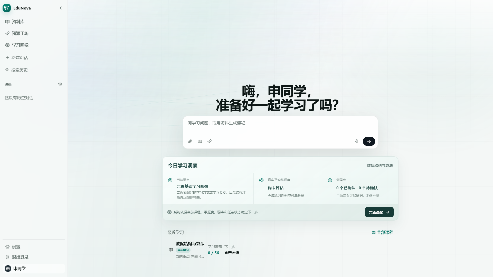

# EduNova

> 面向高校学生的可信、可解释个性化学习系统

EduNova 是面向高校学生的个性化学习系统。它把课程资料、学习画像、智能体协作、资源生成、练习诊断和学习报告连接为可持续优化的学习闭环。

```text
资料解析与建课 → 对话式学习画像 → 课程 RAG 辅导 → 个性化资源与路径
→ 练习诊断与薄弱点 → 再测与下一行动 → 学习报告与课程归档
```



## 核心能力

- **对话式动态画像**：通过自然语言与学习行为形成 8 个维度的学习画像，并区分全局偏好与课程级目标、基础和薄弱点。
- **十类 LangGraph 工作流**：覆盖资料解析、画像、智能建课、主页辅导、课程辅导、资源生成、路径规划、练习评估、报告生成和资料对比。
- **多资料建课与课程 RAG**：上传并确认多份资料后建课；课程问答优先使用课程证据，并展示可核对的来源。
- **多模态个性化资源**：支持讲解文档、思维导图、练习、代码、演示文稿、动画等资源；可保存版本并调整学习策略。
- **动态学习闭环**：根据路径、资源互动、练习、掌握度和弱点生成下一行动；再测结果会影响后续学习安排。
- **智能辅导与隐私控制**：支持流式问答、语音输入与朗读、图片问答、跨会话记忆开关和衍生记忆清除。
- **可靠性机制**：长耗时生成任务提供进度、恢复、取消和重试；模型或外部服务异常时采用明确的失败提示或安全降级，不伪造结果。

## 技术栈

| 层次 | 技术 |
| --- | --- |
| 前端 | React、TypeScript、Vite、TanStack Query、Radix UI、ECharts、Mermaid |
| 后端 | FastAPI、SQLAlchemy、Pydantic、Alembic、SSE |
| AI 编排 | LangGraph、LangChain 适配层、OpenAI-compatible 与讯飞等 Provider 适配 |
| 数据与任务 | PostgreSQL + pgvector、Redis、RQ |
| 文档与安全 | Docling、Pyodide 隔离代码验证、MIME 检测、可选 ClamAV |
| 部署 | Docker Compose、Nginx；Windows Electron + NSIS 桌面安装器 |

## 运行方式

- **Docker 源码部署**：使用以下 BAT 或 Compose 命令，详细步骤见[部署指南](docs/DEPLOYMENT.md)。
- **Windows 桌面安装**：使用 Releases 实际提供的安装器，见[桌面分发说明](docs/DESKTOP_DISTRIBUTION.md)；桌面运行时随安装包提供，不使用 Docker BAT 启动。

以下运行环境与快速启动步骤适用于 Docker 源码部署。

## 运行环境

- Docker Desktop 及 Docker Compose（建议分配不少于 8 GB 内存）
- 可访问 Docker 镜像与 Python/Node 依赖源的网络环境
- AI 对话与生成只需一组主模型凭证；图片能力跟随该模型。默认向量、排序、搜索和语音不需要额外服务 Key。

> 本项目不包含、也不要求提交任何真实 API Key、账号密码、私有资料或个人学习数据。

## 快速启动

### Windows Docker 一键启动

在解压后的项目根目录中，按以下顺序双击：

```text
01_Check_Environment.bat
02_Start_EduNova.bat
```

首次启动会自动由 `.env.example` 创建仅供本机使用的 `.env`，并生成随机的 PostgreSQL 密码、JWT 与配置加密密钥；不会生成或附带任何 AI Provider 凭证。默认端口只绑定本机回环地址，启动后浏览器会自动打开 `http://127.0.0.1:8080`。

另外提供两个辅助脚本：

```text
03_Stop_EduNova.bat       停止服务并保留本机学习数据
04_Reset_Demo_Data.bat    删除项目数据卷中的全部学习数据，不可恢复
```

**日常停止请用 `03`，不要用 `04`。** 重置不区分演示数据和自己的学习数据，使用前必须备份。

各入口的用途和副作用见[脚本说明](scripts/README.md)。

### 启动后要配置什么

1. 注册账号，可选择“空白开始”或内置的“数据结构与算法”课程。
2. 在设置页填写主模型的地址和 API Key，点击“获取模型列表”后搜索选择模型，也可手动填写模型名；保存后测试连接。列表获取支持公网 HTTPS 的 OpenAI 兼容模型目录，本地服务或不提供目录的供应商请手动填写。部署者也可在 `.env` 中配置系统主模型。
3. 图片理解跟随主模型，图片能力测试通过后开放。无需再配置独立识图、向量、重排序、搜索或语音 Key。设置页可选展开“管理多套配置”，保存备用模型并手动启用；切换前请等待当前回答和后台生成任务结束。

不填主模型也能启动、注册和查看内置课程，但 AI 问答、路径与资源生成需要有效模型，不会自动生成演示答案。

| 默认能力 | 准备与限制 |
| --- | --- |
| 本地向量与排序 | 启动脚本准备约 95 MB 向量权重；旧索引不会隐式覆盖，需在设置中按重建流程迁移。见[本地检索](docs/LOCAL_EMBEDDING.md)。 |
| 免 Key 联网搜索 | 本地 SearXNG 仍需访问外部搜索引擎，受网络与上游可用性影响。见[联网搜索](docs/KEYLESS_SEARCH.md)。 |
| 语音输入与朗读 | 启动脚本准备约 238 MB 识别权重；朗读使用浏览器本地中文声音，受设备、权限和声音安装情况影响。见[本地语音](docs/LOCAL_SPEECH.md)。 |

Windows 首次启动无需宿主机 Python，但需要联网下载镜像、依赖及模型；后续复用校验通过的权重。旧部署运行前先备份数据库和 `.env`：启动脚本会清理退役的外部检索、搜索和语音配置，保留主模型配置。

### 手动安装、升级与自定义端口

请按[部署指南](docs/DEPLOYMENT.md)执行完整步骤，包括安全配置初始化、本地模型准备及旧配置迁移。不要覆盖已有 `.env`，也不要跳过模型准备直接启动。修改 `.env` 后需要重新创建相关容器使配置生效。

## 推荐演示路径

1. 注册并选择初始课程，或上传两份课程资料。
2. 确认资料目录，使用多份资料创建专题课程并查看资料对比。
3. 通过自然语言完善课程画像。
4. 在课程空间提问，查看流式回答、来源证据与协作轨迹。
5. 生成学习路径和多种资源，完成一次练习。
6. 查看薄弱点、再测、下一行动变化和学习报告。
7. 在设置页查看跨会话记忆与隐私控制；满足阶段条件后可归档并恢复课程。

## 项目结构

```text
backend/          FastAPI 服务、LangGraph 工作流、数据库迁移与后端测试
frontend/         React 前端、组件、路由与前端测试
desktop/          Electron 桌面宿主、权限边界和安装器构建
code-verifier/    Pyodide 隔离代码验证服务
docker/           Dockerfile 与 Nginx 配置
evals/            离线 AI 质量评测
scripts/          启动辅助、检查与测试脚本（见 scripts/README.md）
docs/             公共使用与技术文档（见 docs/README.md）
docker-compose.yml Docker Compose 启动编排
.env.example      不含真实密钥的配置示例
VERSION.txt       源码发布线标识（桌面版本见 desktop/package.json）
THIRD_PARTY_NOTICES.md 主要第三方组件与许可证说明
```

## 文档导航

- [完整文档索引](docs/README.md)：按使用、部署和开发任务查找文档与代码
- [脚本说明](scripts/README.md)：BAT 入口、维护脚本及数据安全边界
- [用户指南](docs/USER_GUIDE.md)：从注册、建课到学习闭环的使用路径
- [系统架构](docs/ARCHITECTURE.md)：服务边界、数据流和核心约束
- [API 文档](docs/API.md)：HTTP 接口和调用合同
- [数据库设计](docs/DATABASE_DESIGN.md)：实体、迁移和隔离规则
- [Agent 设计](docs/AGENT_DESIGN.md)：LangGraph 工作流与质量门禁
- [RAG 设计](docs/RAG_DESIGN.md)：课程检索、引用和降级策略
- [部署指南](docs/DEPLOYMENT.md)：本地运行与生产加固
- [隐私说明](docs/PRIVACY.md) 与 [安全设计](docs/SECURITY.md)：数据边界和技术安全机制；漏洞报告见[安全政策](SECURITY.md)
- [依赖许可证清单](docs/DEPENDENCY_LICENSES.md)：直接依赖的版本与许可证

## 验证命令

```powershell
# 在已安装开发依赖的仓库根目录执行；验证范围见 CONTRIBUTING.md
powershell -NoProfile -ExecutionPolicy Bypass -File scripts/verify_encoding.ps1
powershell -NoProfile -ExecutionPolicy Bypass -File scripts/test.ps1
docker compose config --quiet
```

## 发布源码包说明

发布源码包应包含运行所需源码、Docker 配置、依赖清单、`.env.example`、本 README 与许可证；不应包含：

```text
.git/、.env、node_modules/、.venv/、dist/、storage/、var/、output/
.planning/、docs/local/、本地研究和开发过程资料
缓存、日志、真实上传资料、导出文件、截图、测试账号数据、API Key
```

`docs/assets/` 中的公开产品预览图是文档的一部分，可以保留；其他运行截图和测试资料不要打包。

建议从稳定 tag 或经过验证的 `main` 提交导出源码包，确保发布内容与 GitHub 版本一致。

## 开源与贡献说明

主要第三方组件及许可证见 [THIRD_PARTY_NOTICES.md](THIRD_PARTY_NOTICES.md) 和 [依赖许可证清单](docs/DEPENDENCY_LICENSES.md)。参与开发前请阅读 [贡献指南](CONTRIBUTING.md)；安全问题按 [安全策略](SECURITY.md) 私密报告。

## 许可证

本项目采用 [MIT License](LICENSE)。
