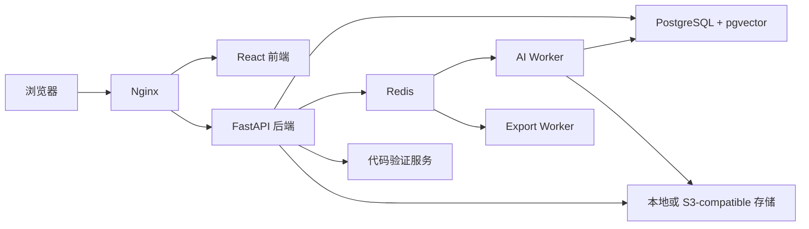

# EduNova 架构

本文档描述当前代码的运行结构。接口细节以 `backend/openapi.json` 为准，数据库结构以 SQLAlchemy 模型和 Alembic 迁移为准。

## 1. 系统概览

Docker 部署由十个默认 Compose 服务组成：`postgres`、`redis`、`backend`、`ai-worker`、`export-worker`、`code-verifier`、`frontend`、`nginx`、`searxng` 和 `speech`；启用 `security` profile 后会增加一个可选的 ClamAV 扫描服务。本地 Web 入口通过 Nginx 提供，Backend 端口可用于查看 API 文档；生产环境应只公开 Nginx，数据库、队列、Backend 和代码验证服务保留在内部网络。

Windows 桌面部署复用相同前端与领域后端，由 Electron 宿主和 Windows 服务控制器管理随包运行时，静态前端与 API 通过本地回环端口同源提供。桌面不依赖上述 Compose 服务名或 Nginx；生命周期合同见[桌面运行时](DESKTOP_RUNTIME.md)。

## 2. 前端

前端位于 `frontend/`，使用 React、TypeScript、Vite、TanStack Query、Zustand、Radix UI、ECharts、Mermaid 和 Markmap。

主要职责：

- 账号注册、登录和会话恢复；
- 资料库、课程空间和知识点导航；
- 流式辅导、来源引用和安全协作摘要；
- 学习路径、资源工坊、练习、报告与画像；
- AI Job 进度、取消、重试和刷新恢复；
- 模型、隐私、语音和存储相关设置。

前端传输类型由 FastAPI OpenAPI 生成到 `frontend/src/types/openapi.generated.ts`。页面 ViewModel、Query Key、缓存失效和业务状态仍由前端维护。

确认弹窗复用 `components/primitives/Dialog.tsx` 的 `ConfirmDialog`；默认布局与遮罩由随组件加载的 `styles/dialog.css` 提供。Portal 挂载在 `body`，弹窗面板必须使用全局不透明的 `--dialog-surface`（附实色回退），不能依赖 `.route-main-surface-wide` 内的局部变量。自定义确认框也遵守同一底色约束。浏览器回归需检查实际计算背景色、遮罩、焦点约束及窄屏边界；仅有组件交互测试不能证明背景不透明。

## 3. 后端

后端位于 `backend/app/`，按以下边界组织：

| 层 | 目录 | 职责 |
| --- | --- | --- |
| API | `api/` | 路由、鉴权、输入输出合同和错误映射 |
| Schema | `schemas/` | Pydantic 传输与结构化输出模型 |
| Service | `services/` | 业务规则、事务、权限和外部适配 |
| Agent | `agents/` | LangGraph 工作流和质量门禁 |
| Model | `models/` | SQLAlchemy 持久化模型 |
| Core | `core/` | 配置、安全、日志和可观测性 |

领域服务不直接依赖前端类型。模型 Provider、对象存储、搜索、文档解析和队列都通过适配边界接入。

## 4. 数据与文件

PostgreSQL 保存账号、课程、知识点、画像、学习任务、资源、练习、报告、会话、任务和安全元数据。pgvector 用于可选的向量检索；没有可用向量服务时可以退回关键词检索。

Redis 承担：

- RQ 后台任务队列；
- 任务取消和活动状态；
- 模型调用并发控制与熔断；
- 部分短期运行状态。

上传文件、聊天附件和导出文件不写入数据库正文。开发环境使用本地目录，公开部署可切换到 S3-compatible 存储。

## 5. 异步任务

耗时操作使用 `ai_jobs` 或 `export_jobs` 持久化状态，再交给 RQ Worker 执行。客户端可以查询任务，也可以订阅 SSE 进度。

任务状态以数据库为准。Redis 负责排队和运行协调，但不能替代持久化事实。刷新页面后，客户端从后端恢复任务和产物状态。

## 6. Agent 与模型调用

EduNova 使用十类工作流处理画像、资料、建课、辅导、资源、路径、练习和报告。工作流只编排领域步骤；用户隔离、客观评分、引用合法性、数据写入和失败边界由确定性代码控制。

模型调用统一经过配置解析、超时、有限重试、并发限制、取消检查和安全审计。用户配置与系统配置分开管理；请求失败不会自动转发到未经用户选择的其他 Provider。

## 7. 可观测性

HTTP、数据库、Redis 和 Worker 可以接入 OpenTelemetry。`agent_run_logs` 与 `model_call_runs` 保存受限运行元数据，用于恢复、诊断和质量审计，不保存完整系统提示词、用户资料原文或明文密钥。

## 8. 核心约束

- 所有用户数据按 `user_id` 隔离，课程数据进一步按 `course_id` 限定。
- 课程引用必须绑定当前用户可访问的真实资料或知识切片。
- 网页来源只能作为外部补充，不能直接修改掌握度或客观评分。
- 模型输出必须经过 Pydantic 合同和业务门禁后才能持久化。
- 规则降级、模型生成和外部服务状态在结果中显式区分。
- 公共 API 不暴露 Provider 凭据、内部提示词、文件系统路径或原始推理内容。

## 9. 事实来源

| 内容 | 权威位置 |
| --- | --- |
| HTTP 合同 | `backend/openapi.json`、`backend/app/api/` |
| 数据结构 | `backend/app/models/`、`backend/migrations/versions/` |
| 工作流 | `backend/app/agents/workflows.py` |
| 部署服务 | `docker-compose.yml` |
| 前端路由 | `frontend/src/app/` |
| 环境变量 | `.env.example`、`backend/app/core/config.py` |
