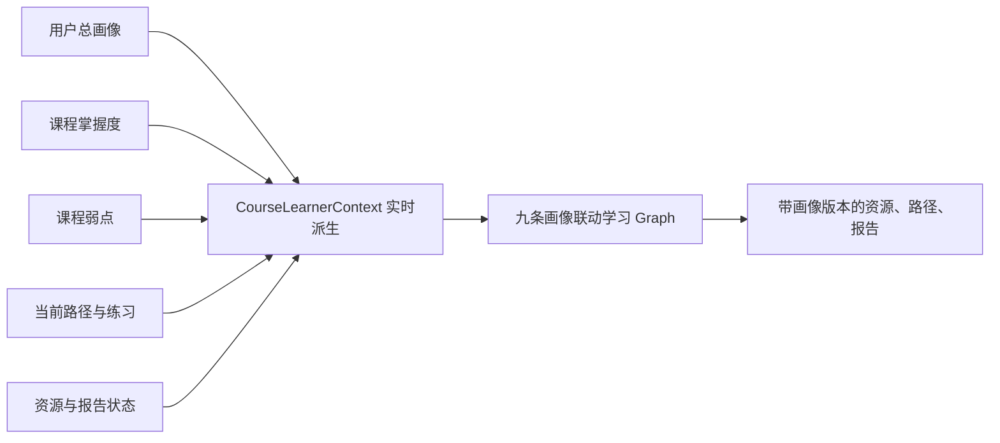

# EduNova 架构设计说明

日期：2026-07-01

## 1. 架构目标

EduNova 的架构目标是支持一个可演示、可部署、可开源、可扩展的 AI 个性化学习空间。第一版重点不是堆功能，而是保证学生学习主链路稳定、AI 输出可解释、多智能体过程可追踪、上传资料能形成课程知识库。

核心原则：

1. 学生端优先，避免第一版变成泛教务平台。
2. 业务服务和 AI 编排解耦，避免所有逻辑堆在接口层。
3. 大模型 Provider 可替换，避免绑定单一厂商。
4. RAG、引用、ReviewAgent 贯穿 AI 输出，降低幻觉风险。
5. 长任务可追踪，前端不长时间白屏。
6. 数据按用户和课程隔离，便于后续开源多人使用。
7. Docker Compose 一键部署，便于比赛提交和同学试用。

## 2. 总体架构

```text
React + TypeScript 学生 AI 学习空间
        ↓ HTTP / SSE
FastAPI 后端 API
        ↓
业务服务层
        ↓
LangGraph 多智能体编排
        ↓
模型 Provider + RAG 检索 + PostgreSQL + Redis + 文件存储
```

部署视角：

```text
浏览器
  ↓
Nginx
  ├── 前端静态资源
  └── /api 转发到 FastAPI
          ├── PostgreSQL + pgvector
          ├── Redis
          ├── 本地文件存储
          └── 外部大模型服务
```

Docker Compose 为 PostgreSQL、Redis 和导出文件分别使用固定命名卷 `postgres_data`、`redis_data` 和 `export_data`。Redis 不依赖镜像自动创建的匿名 `/data` 卷，避免服务重建后遗留无归属的哈希卷。

## 3. 前端架构

前端使用 React + TypeScript + Vite，定位为学生 AI 学习空间。具体设计基线见 [UI_UX_DESIGN.md](UI_UX_DESIGN.md)，入口与路由设计见 [FRONTEND_ROUTING_DESIGN.md](FRONTEND_ROUTING_DESIGN.md)，课程空间双模式改造见 [COURSE_SPACE_DESIGN.md](COURSE_SPACE_DESIGN.md)。

第一版前端不采用后台管理式左侧菜单，也不把首屏做成卡片堆。

当前应用区统一使用 `AppSidebar` 贴边工作区外壳：

- 主页 `/app` 显示主页历史。
- 课程空间显示当前课程的课程内历史。
- 普通二级路由不注入 demo 历史。
- 个人资料、设置和退出登录固定在侧栏底部。
- “新建对话”回到 `/app` 主页。

主页 `/app` 是总 AI 学习入口：

- 初始态展示中心输入框和最近学习。
- 发送后进入对话态，输入区固定到下方。
- 输入区支持上传、资料库、生成课程和语音；联网搜索与推理强度由后端自动决策，不展示手动开关。
- Enter 发送，Shift+Enter 换行。

资料库 `/app/library` 是文件库式资料管理页：

- 资料独立存在，不默认归属课程。
- 支持文档/图片筛选、搜索、详情和上传。
- 从资料生成课程使用上层浮层，不替换当前页面。

课程空间 `/app/courses/:courseId` 承载课程上下文：

- 真实课程标题、资料数、知识点数和知识点列表。
- 课程内历史、课程消息和引用持久化。
- 课程知识库检索、引用来源、证据层和流式回答。
- 资源、路径、练习和报告入口仍保留为后续学习闭环承载位。
- Phase 6.5 前端采用双模式：默认问答模式承载课程版 AI 对话，知识点入口和来源进入学习模式，中间显示学习内容，右侧提供上下文 AI 辅导。

当前已经接入真实后端的数据：

- 注册登录和 `starter_mode` 初始化。
- 主页 summary、主页历史和资料库浮层。
- 个人资料库上传、列表、详情和进度。
- TXT/Markdown/PDF/DOCX/PPTX 已解析资料生成课程。
- 课程详情、知识点、课程会话、RAG 引用和流式回答。
- 多模型配置管理、回答/向量独立默认和连接测试。
- 主页与课程空间内置联网搜索和自适应推理、`home_tutor/course_tutor` trace、浏览器语音输入和朗读。
- 资源工坊、画像、持续学习路径、练习、报告、资料对比和学习档案导出。

当前仍需继续打磨的区域：

- Graph trace 视觉表达和更多浏览器 E2E。
- OCR、旧版 Office 和扫描件解析。
- 资料对比结果持久化与独立恢复；对比结果不隐式进入路径或练习。
- 导出文件版式细节。

联网搜索和推理属于主页与课程 Graph 的内置运行期能力，不属于模型连接设置，也不由前端按钮控制。

目录规划：

```text
frontend/src/
├── api/              接口调用
├── app/              路由和应用入口
├── components/       通用组件
├── features/         按业务能力拆分的功能模块
├── pages/            页面
├── styles/           全局样式和设计 token
├── types/            类型定义
└── visualizations/   学习画布、图谱、雷达图和思维导图
```

首页首屏结构：

```text
贴左边缘主页侧栏：主页历史对话、新建对话、资料库、资源工坊、个人资料、设置、退出登录，可收起
中央：轻量输入框，支持文件上传、选择资料、生成课程
发送后：主页对话流 + 下方固定输入区
输入区：上传资料文件 / 打开资料库 / 生成课程 / 语音 / Enter 发送；自动联网与推理状态只在实际执行时通过 SSE 和 trace 披露
下方：最近学习轻量列表 / 最近课程入口
回答下方：引用来源、学习路径建议、Agent 过程，可展开
```

核心前端模块：

| 模块 | 作用 |
| --- | --- |
| `AppSidebar` | 受保护应用区统一贴边工作区侧栏，普通二级路由承载资料库、资源工坊、个人资料、设置、退出登录和收起控制；主页承载主页历史，课程空间承载课程内历史 |
| `HomeChat` | 总 AI 学习主页，对话可以独立存在，也可以移入某一课程 |
| `CommandBar` | 自然语言主入口，触发上传资料、选择资料、生成课程、基于资料问答和保存回答 |
| `MaterialContextPanel` | 轻量资料上下文，连接独立资料库、主页对话和课程资料 |
| `LearningCanvas` | 课程内可视化模块，展示课程焦点、知识点网络、学习路径节点、资料流入和薄弱点 |
| `SourceCluster` | 课程内展示资料源、解析状态和引用覆盖度 |
| `StudioDock` | 展示讲解、练习、思维导图、代码实操、PPT、动画图解六类结构化产物 |
| `AgentTimeline` | 展示多智能体步骤、耗时、状态和失败节点 |
| `MasteryVisual` | 展示画像雷达、知识点掌握状态和薄弱点复习队列 |

主要页面：

| 页面 | 作用 |
| --- | --- |
| 登录/注册 | 进入系统 |
| 学习主页 | 第一屏主体验，承载贴边可收起主页历史、侧栏账号入口、轻量输入框、发送后主页对话态、资料选择、文件上传和最近课程 |
| 资料库 | 文件库式独立资料管理，支持真实上传、搜索、文档/图片筛选、查看详情反馈、作为主页参考和从已解析资料生成真实课程；生成课程以浮层覆盖当前页面 |
| 课程空间 | 默认问答模式 + 按需学习模式，承载课程内历史对话、真实引用、混合检索状态、知识点/引用学习内容、AI 辅导、练习和报告等学习闭环入口 |
| 学习路径 | 独立路径工作区，展示阶段任务、路径依据和下一步行动，后续接 `learning_paths` 与 `learning_tasks` |
| 资源工坊 | 查看和管理生成的学习资源；当前已补资源生成工作台、生成队列和输出区 |
| 画像 | 查看学习目标、基础、节奏、薄弱点和画像证据 |
| AI 辅导 | 课程空间内的流式问答、引用与连续追问能力，不单设中转页面 |
| 练习 | 作答、批改反馈和薄弱点复习队列 |
| 报告 | 查看画像、掌握度、薄弱点、学习报告和导出入口 |
| 设置 | 配置模型 Provider、个人信息、隐私数据边界和导出数据 |

路由结构：

| 路由组 | 路径 |
| --- | --- |
| 公开入口 | `/`、`/login`、`/register` |
| 应用区 | `/app`、`/app/library`、`/app/path`、`/app/courses/:courseId`、`/app/studio`、`/app/profile`、`/app/practice`、`/app/reports`、`/app/settings` |
| 兼容跳转 | 旧 `/app/tutor` 地址经登录保护后回到 `/app`；不再对应独立页面 |
| 兜底 | `*` |

路由保护：

- `ProtectedRoute` 统一保护 `/app/*`。
- `PublicOnlyRoute` 处理已登录用户访问 `/login` 和 `/register`。
- API client 收到 401 后清理登录态并跳回 `/login`。
- 快速体验通过真实注册流程安装当前用户独立的数据结构与算法内置课程，不创建共享账号或前端假 session。

前端状态分工：

- 登录态：Zustand 保存 token 和用户信息。
- 服务端数据：React Query 管理请求、缓存和刷新。
- 页面临时状态：React 本地状态。
- 长任务进度：轮询或 SSE。

前端技术选型：

| 能力 | 选型 |
| --- | --- |
| 样式 | Tailwind CSS + 自定义设计 token |
| 无障碍基础组件 | Radix UI 或 shadcn/ui 按需引入 |
| 动效 | Motion，所有动效支持 reduced motion |
| 学习画布 | React Flow 或自定义 SVG/Canvas |
| 数据可视化 | ECharts |
| Markdown/思维导图 | Markdown 渲染 + Mermaid / Markmap（npm 包使用 `markmap-lib` 和 `markmap-view`） |

当前已落地的前端基础模块：

| 模块 | 当前状态 |
| --- | --- |
| `frontend/package.json` | pnpm、Vite、TypeScript、React、Tailwind CSS v4、Vitest、ESLint 依赖和脚本 |
| `frontend/src/app` | `App`、`AppProviders`、集中路由、路由常量、`ProtectedRoute`、`PublicOnlyRoute` |
| `frontend/src/features/auth/authStore.ts` | Zustand 登录态，保存真实 JWT token 和当前用户信息 |
| `frontend/src/features/auth/authMappers.ts` | 把后端 `display_name`、`starter_mode` 映射成前端 `displayName`、`starterMode` |
| `frontend/src/api/client.ts` | Axios 客户端，默认基础路径 `/api/v1`，自动附加 token，401 清理登录态并返回登录页 |
| `frontend/src/api/*.ts` | 按业务域拆分的前端 API 合同模块，默认基础路径 `/api/v1` |
| `frontend/src/features/workspace/workflowState.ts` | 上传建课生命周期和短状态信号的纯状态模型 |
| `frontend/src/pages` | 登录、注册、学习空间、资料库、课程空间、学习路径、资源工坊、画像、练习、报告、设置和 404；AI 辅导由课程空间直接承载 |
| `frontend/src/components` | 贴边侧栏、学习空间壳子、学习画布、资料源簇、命令栏、资源输出区、证据层、Agent 轨迹、局部反馈和轻量 toast |
| `frontend/src/styles/global.css` | 视觉 token、响应式布局、reduced motion 和 reduced transparency 基础 |

前端 API 模块当前分工：

- `auth.ts`：注册、登录、读取当前用户、退出。
- `dashboard.ts`：学习空间首页 summary。
- `materials.ts`：上传、列表、详情、进度和课程关联。
- `courses.ts`：课程列表、详情、v2 概览、知识点先修关系和智能建课。
- `rag.ts`：课程知识库检索和混合检索字段。
- `tutor.ts`：主页/课程会话、消息、引用和资料参数，以及 home/course 共用 SSE 的状态、来源、token、Review 替换和完成事件；旧联网/深思字段仅作向后兼容。
- `exports.ts`：旧同步 Markdown 学习档案导出和 Markdown/PDF/DOCX 异步导出任务。
- `settings.ts`：回答、向量和重排序连接读取、保存、独立测试、默认用途与向量重建任务。

当前边界：

- Phase 4.1 已完成真实注册、登录、读取当前用户和退出闭环；注册 starter mode 已落入后端注册接口和用户初始化流程。
- `/dashboard/summary` 首页总览读取当前登录用户的真实数据；`blank` 用户保持空课程，`data_structures` 用户显示自己的内置课程，但主页资料摘要仍只统计个人上传原文件。
- Phase 4.3 已完成受保护的 `/tutor/sessions` 主页会话与消息持久化；当前 `/app` 首次发送会创建 home session，连续追问复用当前 session，主页 assistant 调用当前用户默认模型生成普通回答。完整主页历史由 `/tutor/sessions/history` 分页查询并做服务端正文搜索，`/dashboard/summary` 只保留首页轻量最近数据。当前会话通过内部 `session_id` 恢复，详情响应同时恢复会话级 `selected_material_ids`。
- Phase 4.4 已完成受保护的 `/materials` 真实资料库闭环；当前 `/app` 上传资料会写入个人资料库并刷新 `/dashboard/summary`，`/app/library` 从 `/materials` 读取当前用户资料，支持文档/图片筛选、搜索、详情反馈和上传刷新。
- Phase 22 起 PDF/DOCX/PPTX 由 `DocumentStructureExtractor` 适配 Docling，继续输出 EduNova 的页、块和目录合同；TXT/Markdown 保留轻量解析。旧版 DOC/PPT、图片和扫描件不伪装解析完成。
- Phase 5.2 已完成受保护的 `/rag/search` 课程知识库检索；Phase 6.4 后检索会优先融合关键词分数和向量分数，并把真实资料、章节、切片引用和检索状态保存到 assistant 消息。
- Phase 5.3 已完成课程空间 `scope=course` 会话持久化；课程侧栏历史来自 `/tutor/sessions?scope=course&course_id=...`，点击历史会恢复真实 messages 和 `citation_json`。
- 当前主页 assistant 由 `HomeTutorGraph` 接管并使用流式输出。主页允许模型通用知识，已选资料通过独立 `material_chunks` 做资料级混合检索，自动联网结果作为可追溯证据；未配置搜索 Key 时 warning 只进入来源/轨迹区。`CourseTutorGraph` 先检索严格课程 RAG，只在时效、显式核实或已确认课程相关且无课程命中时加入 `external_supplement`；外部来源不进入画像、弱点、掌握度或课程证据。
- 主页资料范围属于 `chat_sessions`，只有用户确认后保存；发送请求省略资料字段时复用会话范围。生成课程使用独立选料状态，AI Job 恢复只恢复建课请求摘要，不覆盖主页会话资料。
- 当前 `/app/courses/:courseId` 的课程标题、知识点、课程历史、课程消息和课程引用来自真实接口。
- 命中引用且模型可用时，课程 assistant 内容来自 OpenAI-compatible 模型回答。
- 课程页保留支持 Authorization、POST body 和 AbortSignal 的 Fetch，由 `eventsource-parser` 处理 SSE 分包、UTF-8 边界和多行数据。
- Phase 6.4 起课程引用来自混合检索，缺少外部 embedding 配置时显式显示本地 fallback。
- Phase 6.5 起课程页默认不再常驻知识画布、资源区、证据层、横向知识点条或主区重复历史；来源、生成资源、学习路径和课堂协作轨迹收敛到回答下方，知识点入口和引用可进入学习模式。
- 资源、学习路径和 Agent 轨迹已经接入真实接口；后续重点是体验和验收打磨。
- 当前资料库、资源工坊、画像、课程空间辅导、练习、报告和设置均不依赖核心样例数据兜底；只保留真实空态和错误态。
- 当前前端已移除 `ActionNotice` 类全局横向提示条；按钮反馈优先通过选中态、列表刷新、详情面板、输入内容和真实路由跳转表达。失败、校验错误和模型不可用等需要用户处理的状态使用局部 `InlineFeedback`，模型配置保存、设默认、删除和连接测试等短确认使用右下角 toast；后续接 API 时应把对应 handler 替换为 React Query mutation、轮询或 SSE 任务状态。
- 上传解析状态由 `/materials/{material_id}/progress` 驱动；智能建课状态由 `/courses/from-materials/jobs` 和 `/ai-jobs/*` 的持久化节点进度驱动，不使用前端伪进度。
- Markmap 已用于结构化思维导图，Mermaid 已用于动画图解；React Flow 已接管课程学习模式的知识点与先修关系图，ECharts 已用于路径掌握度和报告练习趋势。旧 CSS 绝对定位知识画布已删除。

## 4. 后端架构

后端使用 FastAPI，采用分层结构。

```text
backend/app/
├── api/          HTTP 接口层
├── core/         配置、安全、日志、SSE
├── db/           SQLAlchemy Base、engine、Session
├── models/       SQLAlchemy 数据模型
├── schemas/      Pydantic 请求响应模型
├── services/     业务服务
├── agents/       多智能体编排
├── providers/    大模型适配
├── rag/          向量检索和引用
└── tasks/        长任务和进度
```

当前已落地的后端基础模块：

| 模块 | 当前状态 |
| --- | --- |
| `backend/app/main.py` | FastAPI 应用和 `/api/health` |
| `backend/app/core/config.py` | 环境配置，读取数据库、Redis、JWT、上传资料、联网搜索、导出队列、AI 任务队列和模型 Provider 配置 |
| `backend/app/db/base.py` | SQLAlchemy Declarative Base |
| `backend/app/db/session.py` | 数据库 engine、Session 工厂和依赖入口 |
| `backend/app/models` | 用户、课程、资料、知识点、知识切片核心模型，以及画像、路径、资源、Agent 轨迹、练习、报告、对话和模型设置基础模型 |
| `backend/app/data/builtin_courses/data_structures/` | 8 个理论章节、伪代码、16 个实验和公开书目组成的静态内置课程包 |
| `backend/app/services/course_seed.py` | 为用户确定性安装课程内部来源，并按内部 slug 幂等替换旧内置课 |
| `backend/app/services/tutor.py` | 主页/课程会话 API 边界和依赖装配；`HomeTutorGraphRunner` 接管主页上下文、路由、资料检索、联网、规划、回答、Review/Repair 和持久化，`CourseTutorGraphRunner` 接管严格课程 RAG 问答 |
| `backend/app/services/model_settings.py` | 模型设置服务，负责单配置内回答/向量/重排序独立连接、三类默认、系统兜底、凭证加密、连接测试与实际向量维度识别 |
| `backend/app/services/model_execution.py` | 统一模型执行运行时，负责同配置有限重试、Redis 并发租约、熔断、取消检查和独立安全审计 |
| `backend/app/services/embeddings.py` | Embedding 服务，负责讯飞原生与 OpenAI-compatible 动态维度调用、配置指纹和切片向量写入；无配置时只返回关键词 fallback |
| `backend/app/providers/retrieval.py` | 讯飞签名 Embedding、UTF-8 2KB 分片池化、硅基/百炼 Rerank Provider |
| `backend/app/services/course_answers.py` | 回答服务，负责主页学习 prompt、资料/网页来源摘要、深度回答指令、课程引用受控 prompt、非流式或流式模型 Provider 调用、未配置和模型失败处理 |
| `backend/app/services/material_parsers.py` | 资料解析器，负责 TXT/Markdown/PDF/DOCX/PPTX 文本抽取，并明确 OCR、旧版 Office 和扫描件边界 |
| `backend/app/services/materials.py` | 个人资料库服务，负责上传保存、解析、列表、详情、进度和课程资料关联 |
| `backend/app/services/material_retrieval.py` | 共享资料分块和主页资料级 RAG，负责上传后切片、既有资料惰性补齐、当前用户选中资料限制、关键词/pgvector 混合排序和安全引用 |
| `backend/app/providers/capabilities.py` | Provider 能力注册表，保守声明星火/官方 OpenAI 原生搜索，普通兼容接口不猜测能力 |
| `backend/app/agents/search_tools.py` | LangChain `@tool` 与 LangGraph `ToolNode` 搜索适配层，供 DeepSeek/普通兼容模型决策后的外部搜索回退使用 |
| `backend/app/services/web_search.py` | Tavily-compatible 外部联网搜索服务，未配置 Key 时返回 warning，不生成假来源 |
| `backend/app/services/semantic_decision.py` | 使用当前用户有效回答模型输出独立问题、历史引用、结构化意图、联网查询、推理模式和可选课程画像信号；检索后继续判断课程相关性与证据充分性 |
| `backend/app/services/conversation_memory.py` | 当前用户隔离的跨会话派生记忆、隐私设置、向量检索和 RQ 索引调度；不复制原始聊天 |
| `backend/app/agents/tool_policy.py` | 只保留旧 true 字段、明确联网命令和模型不可用时的保守降级，不再用关键词枚举推断资源、时效或复杂度 |
| `backend/app/services/courses.py` | 课程 API 边界和依赖装配；`CourseBuilderGraphRunner` 接管来源大纲、课程结构、知识点、切片、embedding、审核/修订与事务持久化 |
| `backend/app/services/exports.py` | 学习档案导出服务，负责旧同步 Markdown 兼容接口和 Markdown/PDF/DOCX 异步 job 渲染 |
| `backend/app/workers/export_jobs.py` | Redis/RQ 导出 worker 入口 |
| `backend/app/services/ai_jobs.py` | `AIJobRuntime` 服务，负责任务创建、幂等、活动上限、状态/心跳、取消、重试、失联检测和 Graph 依赖装配 |
| `backend/app/workers/ai_jobs.py` | 独立 `edunova_ai` Redis/RQ worker 入口 |
| `backend/app/api/v1/ai_jobs.py` | AI 任务列表、详情、SSE、取消和重试接口 |
| `backend/app/api/v1/tutor.py` | `/api/v1/tutor/sessions` 受保护会话接口 |
| `backend/app/api/v1/materials.py` | `/api/v1/materials/*` 和 `/api/v1/courses/{course_id}/materials` 受保护资料接口 |
| `backend/app/api/v1/courses.py` | `/api/v1/courses/*`、同步 `/from-materials` 和异步 `/from-materials/jobs` 受保护课程接口 |

内置课程与个人资料库分层：内置章节写入 `course_materials` 和 `knowledge_chunks`，只在课程内容与引用接口中可见；只有用户上传原文件写入 `materials`。Docker backend 在 Alembic 迁移后执行 `sync-builtin-courses`，安装过程不调用模型、网络或 RQ Worker。
| `backend/app/api/v1/settings.py` | `/api/v1/settings/model` 和 `/api/v1/settings/model/test` 受保护模型设置接口 |
| `backend/app/providers/openai_compatible.py` | OpenAI-compatible Provider，支持非流式/流式回答、Spark thinking 控制、最终 content 隔离和动态维度 `/embeddings` |
| `backend/migrations` | Alembic 迁移环境、pgvector 扩展迁移、核心学习表迁移、学习闭环表迁移和资料库兼容迁移 |

分层职责：

| 层 | 职责 |
| --- | --- |
| API 层 | 接收请求、鉴权、参数校验、返回响应 |
| Service 层 | 课程、资料、画像、资源、路径、评估等业务逻辑 |
| Agent 层 | 多智能体状态流转和任务编排 |
| Provider 层 | 调用外部大模型和 embedding 服务 |
| RAG 层 | 切片、向量化、检索、引用组装 |
| Model 层 | 数据库实体和关系 |

约束：

- API 层不直接拼大模型提示词。
- Agent 层不直接处理 HTTP 请求。
- Provider 层不关心业务表结构。
- RAG 层必须返回可追溯引用。
- 所有写入用户数据的服务必须校验 `user_id`。

## 5. 数据架构

核心数据分为 8 类：

1. 用户与权限。
2. 课程与上传资料。
3. 知识点、知识切片和向量。
4. 学习画像与画像事件。
5. 学习路径与任务。
6. 生成资源与质量评分。
7. 练习、作答、评估报告和复习队列。
8. 对话、Agent 日志、模型设置和导出任务。
9. AI 长任务状态、进度和安全结果摘要。

数据隔离规则：

- 用户数据必须绑定 `user_id`。
- 课程内容必须绑定 `course_id`。
- 上传资料必须绑定 `user_id`。
- Phase 3 重定向后，上传资料不应强制绑定 `course_id`；资料可以独立存在于资料库，也可以通过关联表加入一个或多个课程。
- 主页对话不强制绑定 `course_id`，课程内对话必须绑定 `course_id`。
- AI 生成结果必须绑定 `trace_id`。
- 对外返回数据前必须验证当前用户是否有访问权限。

## 6. 多智能体架构

EduNova 使用 LangGraph 编排学习闭环多智能体。Service 层继续作为 API 边界和依赖装配层，认证、设置和 Dashboard 等非学习能力保持普通服务，不包装成 Agent。

核心 Agent：

| Agent | 职责 | 主要输出 |
| --- | --- | --- |
| ProfileAgent | 读取和更新学习画像 | 画像 JSON、画像事件 |
| DiagnosisAgent | 识别薄弱点和学习状态 | 诊断摘要、薄弱点 |
| CourseBuilderAgent | 从上传资料构建课程 | 课程大纲、知识点 |
| RetrieverAgent | 检索课程依据 | 引用片段 |
| ResourceAgent | 协调资源生成 | 多类型资源 |
| PathAgent | 规划学习路径 | 路径和任务 |
| TutorAgent | 个性化答疑 | 带引用回答 |
| AssessmentAgent | 评估学习效果 | 掌握度和报告 |
| ReviewAgent | 审核事实性和安全性 | 审核状态、风险提示 |

资源生成流程：

```text
用户选择课程和知识点
  ↓
ProfileAgent 读取画像
  ↓
RetrieverAgent 检索课程资料
  ↓
DiagnosisAgent 判断当前学习状态
  ↓
  PlannerAgent 形成共享生成目标
  ↓
  LangGraph Send 并行派发六类 Worker
  ↓
  AggregateAgent 汇总结构化产物
  ↓
ReviewAgent 审核内容
  ↓
保存资源、评分和 Agent 日志
  ↓
前端展示资源、引用和轨迹
```

当前真实接管生产主流程的是 `MaterialIngestionGraph`、`ProfileGraph`、`CourseBuilderGraph`、`HomeTutorGraph`、`CourseTutorGraph`、`ResourceGenerationGraph`、`PathPlanningGraph`、`AssessmentGraph`、`ReportGraph` 和 `MaterialComparisonGraph`。十条 Graph 都落真实节点耗时和白名单 metadata，生成型节点均有规则与可选模型审核。学习档案导出继续由确定性 Service 聚合并交给 Redis/RQ Worker 生成文件，不注册为生产 Graph。

`ProfileGraph` 的显式画像回答采用模型主导语义抽取：只有通过结构、白名单、隐私和 Review 的模型提案可以更新画像，规则不再补充遗漏或在模型失败时猜测写入。课程问答由同一次语义路由给出可选画像信号，普通提问和“为什么”不代表薄弱；隐式学习信号仍需课程证据、多来源与置信度门控。

### 6.1 AI 长任务运行时

Phase 17 不增加 Graph 数量，而是在 `CourseBuilderGraph` 和 `ResourceGenerationGraph` 外增加统一运行时：

```text
POST jobs + Idempotency-Key
  -> ai_jobs(queued)
  -> Redis edunova_ai queue
  -> ai-worker
  -> GraphRunner(trace_id + AgentJobContext)
  -> 独立 session 写节点进度和心跳
  -> 业务事务提交产物
  -> ai_jobs(completed / failed / cancelled)
  -> SSE，断线时 GET 轮询恢复
```

运行时只保存 ID、资源类型、目标、难度和安全结果摘要，不序列化 ORM 对象、原始资料、模型输入或思维链。取消是节点间协作式取消；持久化前会再次检查取消状态。同步建课和资源接口继续兼容旧客户端，后台接口供当前前端四个生成入口使用。学习档案与资源 PPTX 仍走独立 `edunova_exports` 队列。

后半程闭环：

```text
AssessmentGraph 客观题确定性评分 + 简答题批量语义评分
  -> 错因诊断与 PracticeAnswer 证据
  -> 合并更新 weakness_review_queue
  -> 独立 PathPlanningGraph 重排已有路径
  -> 再练习
  -> 用户主动触发 ReportGraph 聚合最近 5 次练习与趋势
```

评分、掌握度数量和趋势始终由确定性规则负责。模型只能增强题目、诊断、路径排序理由和报告叙事。路径重排发生在练习事务提交之后，失败不会回滚练习与弱点；从未创建路径时返回 `not_started`，不擅自创建默认路径。

资源 Worker：

- DocWorker：讲解文档。
- MindMapWorker：思维导图。
- QuizWorker：练习题。
- CodeWorker：代码实操案例。
- SlideWorker：结构化 PPT 页面与真实 PPTX 源数据。
- AnimationWorker：可播放的 Mermaid 教学场景，不伪装成视频。

资源内容采用 `schema_version=3`，以 `artifact.kind` 区分 `document`、`mindmap`、`quiz`、`code_lab`、`slide_deck`、`animation`，并保存引用绑定、质量门禁、Prompt 版本和 Markdown fallback。Phase 20 的 planner 在 Worker 前生成逐类型 `ArtifactIntent`，明确教学策略、认知层级、案例方向、证据和学习结果；ReviewAgent 同时读取意图、候选内容和历史摘要。模型直接生成类型化 artifact；无有效结构差异时不得标记 `model_enhanced`。前端 `ResourceRenderer` 继续兼容 v1/v2。

代码资源在持久化前调用内部 `code-verifier`。该服务位于独立 internal Docker 网络，采用非 root、只读根文件系统、无外网、能力移除和 CPU/内存/PID 限制；每次请求创建独立 Pyodide Worker，执行安全 AST 门禁、5 秒超时、20KB 输出限制和预期输出精确比对。服务不可用或结果不符时，代码 Worker 失败且不保存资源。

## 7. RAG 与可信生成架构

RAG 流程：

```text
课程资料
  ↓
DocumentParser 文本提取
  ↓
ChunkingService 知识切片
  ↓
EmbeddingService 写入当前 Provider、模型、实际维度和配置指纹对应的向量
  ↓
HybridRetriever 关键词 + 向量混合检索
  ↓
Phase 5.3 课程会话保存 assistant 引用
  ↓
生成回答或资源
  ↓
ReviewAgent 审核
  ↓
带引用展示
```

当前实现状态：

- Phase 5.2 已实现 `KeywordRetriever`：基于 `knowledge_chunks.content`、`section_title`、`course_materials.filename` 和 `knowledge_points` 上下文做确定性评分。
- Phase 5.3 已让课程会话发送消息时复用该检索结果，并把引用写入 `chat_messages.citation_json`。
- Phase 6.1 已让课程会话在有引用且模型配置可用时调用 OpenAI-compatible Chat Completions 生成非流式回答，并把模型内容保存到 `chat_messages.content`，引用继续保存在 `citation_json`。
- Phase 6.3 已新增课程消息流式路径：后端通过 `event: metadata/token/done/error` 输出 SSE，完成后一次性持久化完整 assistant；失败时不保存半截内容。
- `EmbeddingService` 优先使用当前用户向量默认配置或对应服务器兜底。讯飞走原生签名 2560 维接口，百炼/硅基/自定义走 OpenAI-compatible `/embeddings`；查询按用户、范围、Provider、模型、维度和配置指纹隔离。
- 课程与主页资料 RAG 均执行关键词 Top 30、向量 Top 30、RRF Top 20、可选 Rerank、最终 Top 5。向量或重排序失败时逐层回退，API 展示 `retrieval_source`、`embedding_status` 和 `rerank_status`。
- 切换向量默认不会自动消耗额度；`embedding_reindex` AI Job 由用户显式发起，复用 RQ、进度、取消和重试。

可信机制：

1. 检索增强生成。
2. 引用来源绑定。
3. ReviewAgent 审核。
4. 置信度和资料不足提示。
5. 用户反馈和学习证据链。

引用字段至少包含：

- `chunk_id`。
- `material_id`。
- `source_title`。
- `page_number` 或 `section_title`。
- `content_preview`。

## 8. 上传资料建课架构

上传解析与建课是两个独立事务：

```text
上传文件
  ↓
MaterialIngestionGraph
validate -> extract_pages -> normalize_layout -> detect_outline
-> model_refine -> chunk -> quality_gate -> persist
  ↓
用户检查并确认目录版本
  ↓
CourseBuilderGraph
validate_confirmed_materials -> coherence_gate -> load_outlines
-> chapter_plan -> concept_workers -> aggregate -> prerequisite_graph
-> evidence_bind -> review -> repair -> persist
```

资料解析状态：

- `pending/running`：后台解析尚未完成。
- `awaiting_confirmation`：质量通过，等待用户确认目录。
- `confirmed`：目录已确认，可用于问答、对比和建课。
- `failed`：保留原文件与安全诊断，但禁止建课。
- `legacy`：旧资料，用户主动重新解析后进入新流程。

两个 Graph 都使用 `AIJobRuntime`、Redis/RQ 与独立 trace。解析派生数据允许独立持久化；建课只有完整候选通过质量门后才事务性创建课程。资料库不展示切片衍生文件，课程知识点必须绑定真实资料切片。

## 9. 模型 Provider 架构

Provider 抽象目标能力：

- `chat_completion`。
- `stream_chat_completion`。
- `embedding`。
- `model_list`。
- `health_check`。

回答 Provider 支持 OpenAI-compatible 非流式与 SSE。Spark X2-Flash 使用 `spark-x`，普通回答关闭 thinking、主页深思开启 thinking，只消费最终 `content`。向量 Provider 支持讯飞原生协议和 OpenAI-compatible 动态维度；设置页支持：

- 多套用户个人配置，互相隔离保存和测试。
- 回答、向量与重排序使用三套独立预设。默认推荐 X2-Flash、讯飞 LLM Embedding、硅基 `BAAI/bge-reranker-v2-m3`；缺少凭证的能力不启用。
- 同一配置方案内并列回答、向量和重排序服务；三组分别填写自身 Provider、地址、凭证和模型。
- 向量服务用于资料与课程知识库向量化；缺省时明确使用关键词检索 fallback。
- 回答、向量和重排序独立的一次性连通性测试；测试结果按配置安全持久化，未配置某项能力不会影响其他能力。
- 三类默认用途独立选择，同一配置可组合多个服务商，也可只承担一种用途。
- 显式创建向量重建 AI Job；切换默认配置不会自动调用外部服务。
- 学生昵称通过 `PATCH /auth/me` 真实保存，并同步到侧栏账号入口；登录账号、角色和 starter mode 保持只读。登录账号统一小写且创建后不可修改。
- 学生可通过 `PATCH /auth/me/password` 验证当前密码后换密；JWT 携带 `auth_version`，换密后递增版本并使所有旧登录状态失效。
- 隐私与数据边界作为只读说明展示，学习档案导出仍从报告页按课程生成。

配置解析优先级：

```text
当前用户对应用途的默认配置 -> .env 中对应用途的 SYSTEM_MODEL_* -> 未配置提示
```

回答 Key、向量 Key、讯飞 APPID/APISecret 与重排序 Key 均使用 Fernet 加密。每条配置保存三项独立连接和测试摘要，三类默认可指向同一套或不同套方案。`GET /settings/model/configs` 只返回脱敏状态、能力可用性和三类默认配置 ID，不返回明文凭证。

Phase 18 后，个人配置只有在字段不完整时才沿用现有服务器配置兜底；已经对个人配置发起的请求发生超时、限流或服务故障时，只在同一配置内有限重试，不把学习内容自动发送给另一 Provider。普通调用与 Embedding 最多 3 次，流式调用只允许在首 token 前重试。Redis 暂不可用时限流与熔断 fail-open，但模型 HTTP 超时、Graph fallback 和安全审计边界继续生效。

降级策略：

- 用户 Key 优先。
- 用户 Key 不可用时可使用系统 Key。
- 模型不可用时使用明确标记的确定性 fallback，不伪装 Provider 成功。
- 所有 fallback 内容必须显式标记。
- 课程会话命中引用但模型未配置时保留引用并提示未配置；模型超时、失败或流式中断时不写入半截 assistant 消息。

## 10. 安全与隐私架构

安全规则：

- 密码使用 bcrypt 哈希。
- 登录使用 JWT。
- API Key 不明文写入日志。
- 前端仅显示脱敏 Key。
- 上传文件按用户目录隔离。
- 所有资源访问校验所有权。
- 提示词注入内容不得覆盖系统安全规则。
- `.env`、上传文件、日志和缓存不提交 Git。

日志规则：

- 记录 trace_id、状态、耗时、摘要。
- 不记录完整 API Key。
- 不记录用户上传资料的敏感原文到系统日志。
- Agent 日志保存摘要和引用，不保存秘密配置。

## 11. 部署架构

Docker Compose 服务：

| 服务 | 作用 |
| --- | --- |
| frontend | 构建并托管前端静态资源 |
| backend | FastAPI 服务 |
| postgres | PostgreSQL + pgvector |
| redis | 任务进度、缓存、限流 |
| nginx | 统一入口，`/api/` 转发后端，其余请求转发前端 |

默认访问：

```text
http://localhost:8080
http://localhost:8080/api/health
```

环境变量通过 `.env` 管理，仓库只提交 `.env.example`。

## 12. 错误处理

错误响应统一包含：

- `code`：机器可读错误码。
- `message`：用户可读说明。
- `trace_id`：排查用追踪编号。
- `details`：可选细节。

典型错误：

| 场景 | 处理 |
| --- | --- |
| 未登录 | 返回 401 |
| 无权限访问他人数据 | 返回 403 或 404 |
| 上传格式不支持 | 返回 400 并说明支持格式 |
| 模型服务失败 | 返回可恢复错误或降级提示，不写入半截回答，不伪装成真实模型输出 |
| 资料不足 | 返回低依据提示 |
| 长任务失败 | 保存失败状态和错误摘要 |

## 13. 架构验收标准

架构实现达到以下条件，才算第一版可提交：

1. 前后端分层清晰，接口稳定。
2. 核心数据表按用户和课程隔离。
3. RAG 检索能返回引用来源。
4. Agent 流程能记录 trace。
5. 大模型 Provider 可替换。
6. 示例课程和确定性 fallback 能稳定跑通核心链路。
7. Docker Compose 能启动核心服务。
8. 主要设计能在答辩时用图和日志解释清楚。

## 14. 画像上下文架构



- `student_profiles` 仍是唯一长期画像来源；不创建 `course_profiles`，避免课程状态复制后失真。
- `CourseLearnerContext` 只携带通过可信度门槛的安全摘要，并生成 `context_hash`；课程弱点始终按 `course_id` 隔离。
- 资源、路径和报告使用画像应用版本判断 `current/stale/legacy`。画像变化不自动重算成果，用户从原有入口主动更新。

## 15. Phase 19 质量内核

- `ResourceGenerationGraph` 的 ReviewAgent 读取安全资料摘录、学习目标和完整 artifact；结构修复和内容修订各最多一次，单类失败不污染其他成果。
- `AssessmentGraph` 从课程切片形成题目蓝图，模型只改写题面、合理干扰项和解析，不得改变知识点、题型或规则答案；错因诊断逐题读取题干、正确答案、学生答案、得分和证据。
- `ReportGraph` 将五类确定性统计作为不可变字段，模型叙事出现额外数字或混淆统计时触发修订；修订稿需再次经过模型与规则审核。
- 掌握度和路径状态彻底分离。知识点没有有效学习证据时返回未评估，课程平均值只计算 `score != null` 的知识点。
- 资料对比先按概念别名归并 A*、启发式搜索、反向传播等同义内容；会话检索在明显换题时停止拼接旧问题。

## 16. Phase 20 个性化产物与版本

- `ResourceGenerationGraph` 保持原节点边界，但 `planner` 产出六类互补 `ArtifactIntent`；可信画像不足时显式记录 `context_limited`。
- 质量门禁分为真实性、个性化、多样性、教学可用性和类型正确性。替代版本相对来源必须至少改变两项教学策略维度，优化版本必须保持原意图。多样性先使用本地文本与结构指纹；存在可用向量配置时，通过统一 `EmbeddingService` 增加语义相似度门禁，失败时保留明确降级状态而不阻断本地校验。
- `generated_resources` 使用版本族、来源版本和递增版本号保存不可覆盖历史。版本分配在事务中锁定版本族；失败任务不会创建空版本或覆盖来源。
- 资源工坊按版本族展示最新成果，允许切换、比较、回到旧版本，并从任意版本发起“换一种教法”或“优化当前版本”。

## 17. Phase 22 通用基础设施边界

- `DocumentStructureExtractor` 隔离 Docling 与 EduNova 合同。Docling 只提供 PDF、DOCX、PPTX 结构提取；Graph 继续负责规范化、目录确认、质量门禁、章节切片、证据和建课审核。
- Radix 提供模态、焦点和 Toast 原语；页面继续拥有 URL 状态、业务回调与视觉布局。
- 浏览器应用 SSE 由 `sse-starlette` 和 `eventsource-parser` 承载，Provider SSE 则由官方 OpenAI SDK 处理，三层不共享自研字符串解析器。
- Pydantic 响应合同是 OpenAPI 唯一来源，生成类型只覆盖传输层；Axios、React Query 和 ViewModel 仍由前端维护。
- OpenTelemetry 只记录 HTTP、SQL、Redis、队列和任务边界的安全元数据；学生可见 Agent trace 继续保存 EduNova 特有的协作证据。
- `StorageAdapter` 隔离 Local 与 S3-compatible 实现，数据库继续保存字符串对象键并兼容旧本地路径。
- LangChain 已作为窄适配层进入生产：只使用消息裁剪、`@tool` 与 `ToolNode`；不使用通用 Agent、Memory、默认 VectorStore 或 LangSmith。LlamaIndex、Haystack、Dify 与 RAGFlow 未进入当前生产链路。`docs/superpowers` 中的整套 LangChain 方案仍是历史规划。

## 18. Phase 23/24 内置能力策略

- `SemanticDecisionService` 是模型主导的结构化路由；`ToolDecision` 只保留显式强制、安全降级和白名单摘要，不再用关键词枚举决定资源、时效或复杂度。
- 模型判断独立问题、是否引用历史、联网需求和 `auto/deep`；显式“请联网核实”仍由规则强制。
- 课程 Graph 节点为 `profile -> route -> retriever -> web_search -> planner -> tutor -> weakness -> review -> next_action`。课程来源始终优先，网页只作为 `external_supplement`。
- Spark X2-Flash 的 auto/deep 分别映射为 `thinking.auto/enabled`；其他 Provider 不发送未验证私有参数。
- 旧 `use_web_search/deep_thinking=true` 只用于兼容客户端强制启用；false 或缺省均由策略自动判断。

## 19. Phase 25 原生工具与记忆边界

```text
真实会话历史 -> trim_messages -> SemanticDecisionService 独立问题改写
                                  -> 无需搜索 -> 回答模型
                                  -> 需要搜索 -> 原生 Provider 搜索
                                                -> 无可验证来源 -> search_web ToolNode
课程切片 -> 课程证据语义判断 -> 外部补充（可选） -> 回答
```

- 星火 X2-Flash 与官方 OpenAI 可调用厂商托管搜索；来源必须归一为标题、URL、摘要、时间、后端与 `external_supplement`。DeepSeek API 和其他普通兼容地址不假定原生搜索，通过 EduNova 的受控工具执行。
- 一次回答选择一个成功搜索后端。原生不支持、超时、空结果或无可验证 URL 才回退；回退失败继续回答并展示 warning。
- 搜索只发送必要的独立问题文本，不发送课程原文、画像、跨会话摘要或历史私聊。
- 同会话加载真实 `chat_messages` 并按上下文预算裁剪；结构化路由返回 `standalone_query/uses_history/referenced_turn_ids`，ReviewAgent 拒绝在已有历史时声称“无法记住之前对话”。
- 跨会话记忆使用项目数据库与 pgvector，不使用 LangChain Memory。`conversation_memory_entries` 只保存脱敏摘要、原消息引用、向量和模型指纹；检索严格限制当前用户、排除当前会话、最多 5 条。
- 关闭记忆会停止新增和检索并删除派生索引；原始聊天保留。历史对话仅用于上下文，不是教材、画像、掌握度或评分证据。
- 课程证据、资源权限、任务数量、资料解析质量和隐私边界继续由确定性规则门禁；模型只做语义判断或从真实候选中选择。

## 20. Phase 26 下一最佳行动边界

`LearningNextActionService` 位于普通 Service 层，不是新 Agent。它只读取当前用户可见的资料、AI Job、课程、弱点队列、路径任务、掌握度、练习和报告，以固定优先级返回动作语义与安全 ID。后端不返回 URL，前端 `learningActionHref` 是唯一动作路由映射。

全局查询先恢复进行中的资料解析或建课任务，再比较最近未分配资料与最近课程活动；课程级查询强制校验课程归属。React Query 的全局键和当前课程键在资料、课程、画像、资源、路径、练习、重评、报告和 AI Job 完成后统一失效。该层不调用模型、不自动执行写操作、不新增数据库表，也不替代各领域服务的权限与状态机。
# Phase 27 多模态闭环边界

- `CourseLearnerContext` 是问答、资源、路径、练习和报告共享的可信个性化适配层；个性化只改变深度、案例、模态、顺序和难度，不改变课程事实、引用、客观答案或统计。
- `learning_bundle_json` 保存路径任务的教学策略、理由和有序资源项。第三方类型不进入领域实体，缺失资源仍由用户确认后通过既有 AIJob 生成。
- `VideoCurationService` 复用 `WebSearchService`，只归一化 B 站 BV 号和 YouTube 视频 ID。前端不信任任意 `embed_url`，而是从平台与 ID 构造官方播放器地址。
- `resource_interactions` 是课程级轻量行为事实，不是通用埋点平台；它不保存正文、音频、鼠标轨迹或隐私原文。
- 浏览器 Web Speech 只作为渐进增强。语音识别只回填输入框，不自动发送；朗读前清理 Markdown、URL、引用标号和代码块。
- 学生可见“协作过程”来自白名单 Agent trace，禁止展示 Provider 原始思维链、系统提示词、完整模型输入、画像原文和资料原文。

## 21. Phase 28 反馈决策与合同门禁

`resource_interactions` 保持追加式事实表，但下游通过 `aggregate_resource_interactions` 派生“每个资源一次状态 + 最新反馈”，避免切换反馈导致重复累计。`PathPlanningGraph` 在既有一次模型调用中输出每项任务的 2–4 个 `bundle_types`；规则限制合法类型、数量、真实资源和权限。模型失败使用 `doc + mindmap + quiz`，再按课程级反馈稳定排序。

反馈只改变当前课程内的模态优先级和教学策略：`too_hard` 使用基础脚手架，`too_easy` 提高应用/分析层级，至少两份独立资源 `not_helpful` 才触发替代策略。任何模态都保留为候选，不形成长期画像或教材证据。

OpenAPI 漂移检查在临时目录生成 JSON/TypeScript 后与跟踪文件比较，不先改工作区。该门禁因此可以在存在无关未提交改动时仍准确判断合同是否漂移。

## 22. Phase 29 异步路径与国内内容策略

`PathPlanningGraph` 继续拥有课程路径领域状态，但入口统一迁入现有 `AIJobRuntime -> RQ edunova_ai`。手动生成和练习后重排共享同一执行器、进度节点、取消边界与原子持久化；旧同步接口只作兼容。模型仅在 `model_plan` 调用一次，输入最多 24 个合法候选，输出最多 8 个近期优先任务；Review/Repair 不调用模型，只检查任务、资源、模态、可信因素、隐私与最多一个进行中任务。

`ChinaFirstContentPolicy` 是学生可见内容的集中策略适配层，不是新的 Agent。它为问答、资源、路径、练习、报告、资料对比和建课提供统一 `zh-CN/mainland_college_student` Prompt 与元数据；`SemanticDecisionService` 在既有一次路由调用中输出 `mainland_preferred/global_required`。来源访问范围与权威性分开表达，服务端可请求不等于向学生承诺国内可访问。

## 23. Phase 30 本节学习资源闭环

路径任务的 `learning_bundle_json` 是资源工坊之上的编排层，不是第二套资源系统。`POST /paths/tasks/{task_id}/resource-jobs` 从当前用户的有效路径任务派生知识点、难度、教学策略和缺失资源类型，复用既有 `resource_generation` AIJob、RQ 与 ResourceGenerationGraph；已完成且可访问的资源直接复用，同一任务只保留一个活动资源任务。

`LearningBundleItem.learning_status` 以及 `ready_count/completed_count` 均由现有 `resource_interactions` 聚合，不新增表。打开或播放结束不会完成整节；资源工坊按 bundle 顺序提供下一项，用户回到路径页后才手动确认完成本节。未完成资源可经 Radix AlertDialog 明确确认后跳过，生成失败只影响对应资源类型。

## 24. Phase 31 大型教材与真实闭环加固

大型 PDF 继续由 Docling 适配层输出既有解析合同，第三方类型不进入 Graph 或数据库。解析器使用源页数交叉核验；大于 10 MiB 的 PDF 时限按 `max(120 秒, 文件 MiB × 25 秒)` 推导，并受 AIJob 总时限减 60 秒约束。长任务只发送真实心跳和已等待时间，不伪造页级百分比；部分页结果、页数严重不符或质量异常必须失败，旧已确认版本保持不变。

真实闭环加固不新增 Graph、表或基础设施。课程回答增加证据域和数值一致性门禁；资源生成优先使用当前知识点的精确章节证据；资源完成与整节完成严格分离；路径手动更新与练习重排统一保留已完成进度。可信总画像中的明确难点只用于扩大路径模型候选，不直接成为课程弱点、掌握度、评分或教材证据。

PathPlanningGraph 接受 Provider 常见的单层 `output` 协议包装，解包后仍执行同一 Pydantic 严格校验。未知画像因素代码被白名单剔除；伪造任务、资源、模态或权限越界仍使整体方案回退。该兼容层不记录模型原文，也不增加第二次模型调用。
## 25. Phase 32 图片提问架构

图片提问复用 `StorageAdapter`、上传安全、模型运行时和 tutor SSE，但保持独立边界：`ChatMessageAttachment` 只属于当前用户和会话；`VisionUnderstandingService` 通过 OpenAI-compatible `text + image_url` 适配层调用明确声明视觉能力的配置，供应商类型不进入 Graph。视觉输出先经 Pydantic 校验，回答模型只接收结构化摘要和必要课程证据，不接收原始图片。

主页与课程 Graph 的 route 节点复用视觉决策，避免同一图片轮次再调用普通语义路由。文本追问仍先由语义模型产生 `referenced_turn_ids`，随后只在当前会话中查找已绑定图片并重新理解。课程切片继续是教材事实和页码来源；用户图片标为本次提问输入，网页仍是外部补充。日志和 trace 只记录图片数量、Provider 预设、置信度和历史复用状态，不记录 Base64、存储键、视觉原始响应或思维链。
