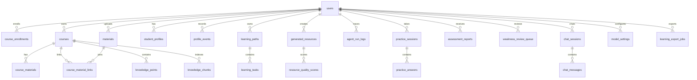

# EduNova 数据库设计

日期：2026-07-01

## 1. 设计目标

EduNova 数据库设计服务于学生个性化学习闭环。第一版需要同时支持内置课程、用户上传建课、RAG 检索、多智能体轨迹、学习画像、学习路径、练习评估和 演示模式。

设计原则：

1. 所有用户私有数据绑定 `user_id`。
2. 所有课程内学习数据绑定 `course_id`，但用户资料库资料可以先只绑定 `user_id`，再通过关联表加入课程。
3. 所有 AI 任务绑定 `trace_id`。
4. 生成内容必须可追溯引用来源。
5. JSON 字段用于保存灵活 AI 结构，但核心查询字段保持结构化。
6. 第一版结构为后续教师端、班级和课程包扩展预留空间。

## 2. 数据库技术

| 能力 | 技术 |
| --- | --- |
| 关系数据 | PostgreSQL |
| 向量检索 | pgvector |
| ORM | SQLAlchemy |
| 迁移 | Alembic |
| 长任务进度 | Redis |
| 文件内容 | 本地文件存储，数据库保存路径和元数据 |

当前 Phase 2A/2B/2C 已落地：

- `backend/app/core/config.py`：读取数据库和 Redis 配置。
- `backend/app/db/base.py`：SQLAlchemy metadata 入口。
- `backend/app/db/session.py`：engine 与 Session 工厂。
- `backend/app/models`：核心业务模型和学习闭环基础模型。
- `backend/app/data/builtin_courses/ai_intro.py`：人工智能导论内置课程包。
- `backend/app/services/course_seed.py`：内置课程导入服务。
- `backend/migrations`：Alembic 迁移目录。
- `backend/migrations/versions/20260701_0001_enable_pgvector.py`：启用 pgvector 扩展。
- `backend/migrations/versions/20260701_0002_create_core_learning_tables.py`：创建用户、课程、选课、资料、知识点和知识切片表。
- `backend/migrations/versions/20260701_0003_create_learning_closure_tables.py`：创建画像、学习路径、生成资源、Agent 轨迹、练习、报告、对话和模型设置基础表。
- `backend/migrations/versions/20260701_0004_add_user_starter_mode.py`：创建注册初始化方式字段。
- `backend/migrations/versions/20260703_0005_create_material_library.py`：创建独立个人资料库 `materials` 和课程资料关联表 `course_material_links`，并从旧 `course_materials` 兼容回填。

Phase 4.2 的 `/dashboard/summary` 不新增表和字段，只读取当前已有数据并整理为首页总览响应。Phase 4.4 后，资料库摘要和最近资料列表改为读取独立 `materials`，未归属数量通过 `course_material_links` 计算。

## 3. 核心关系图



## 4. 表设计

### 4.1 `users`

用途：保存用户账号。

核心字段：

| 字段 | 类型 | 说明 |
| --- | --- | --- |
| `id` | bigint | 主键 |
| `email` | varchar | 邮箱，唯一 |
| `hashed_password` | varchar | 加密密码 |
| `display_name` | varchar | 显示名称 |
| `role` | varchar | `student` 或 `admin` |
| `starter_mode` | varchar | 注册初始化方式，`blank` 或 `ai_intro` |
| `created_at` | timestamptz | 创建时间 |
| `updated_at` | timestamptz | 更新时间 |

约束：

- `email` 唯一。
- 第一版默认 `role=student`。
- 旧用户迁移默认 `starter_mode=blank`；新注册未传时由服务层按 `ai_intro` 处理。

### 4.2 `courses`

用途：保存内置课程和用户上传生成的课程。

核心字段：

| 字段 | 类型 | 说明 |
| --- | --- | --- |
| `id` | bigint | 主键 |
| `owner_id` | bigint | 创建者，内置课程可为空或指向系统用户 |
| `title` | varchar | 课程名称 |
| `description` | text | 课程说明 |
| `subject` | varchar | 学科 |
| `source_type` | varchar | `builtin`、`uploaded`、`demo` |
| `visibility` | varchar | `private`、`public` |
| `status` | varchar | `draft`、`ready`、`failed` |
| `created_at` | timestamptz | 创建时间 |

### 4.3 `course_enrollments`

用途：记录用户和课程关系。

字段：

| 字段 | 类型 | 说明 |
| --- | --- | --- |
| `id` | bigint | 主键 |
| `user_id` | bigint | 用户 |
| `course_id` | bigint | 课程 |
| `role` | varchar | 第一版为 `learner` |
| `progress_percent` | numeric | 进度 |
| `created_at` | timestamptz | 创建时间 |

唯一约束：

- `user_id + course_id` 唯一。

### 4.4 `course_materials`

用途：保存早期课程资料和内置课程知识切片来源。

当前已落地的 Phase 2 表结构把资料直接绑定到课程，`course_id` 为必填。Phase 3 重定向后，产品规则调整为“资料库独立于课程，资料可以加入一个或多个课程”。Phase 4.4 已完成兼容迁移：

```text
materials              独立资料库，绑定 user_id，不强制绑定 course_id
course_material_links  课程与资料的关联表，支持同一资料加入多个课程
knowledge_chunks       仍绑定 course_id，同时引用 material_id
```

迁移后，`course_materials` 暂时保留，用于兼容内置课程和已有 `knowledge_chunks.material_id` 关系；新上传资料写入 `materials`，加入课程时写入 `course_material_links`。Phase 5.1 从 TXT/Markdown 资料生成课程时，会为新课程创建兼容旧链路的 `course_materials` 副本，同时用 `course_material_links.usage_type=course_source` 关联原个人资料库资料，保证后续 RAG 可以沿 `knowledge_chunks -> course_materials` 接入。

字段：

| 字段 | 类型 | 说明 |
| --- | --- | --- |
| `id` | bigint | 主键 |
| `user_id` | bigint | 上传者 |
| `course_id` | bigint | 所属课程 |
| `filename` | varchar | 原文件名 |
| `content_type` | varchar | 文件类型 |
| `storage_path` | text | 文件存储路径 |
| `parse_status` | varchar | 解析状态 |
| `extracted_text` | text | 提取文本 |
| `metadata_json` | jsonb | 页码、标题、字数等元数据 |
| `created_at` | timestamptz | 创建时间 |

### 4.4.1 `materials`

用途：保存用户上传到个人资料库的原始资料和解析结果。Phase 4.4 已落地；`.txt`、`.md` 会轻解析为 `completed`，PDF/DOCX/PPTX/图片先保存为 `uploaded`，图片不做 OCR。

字段：

| 字段 | 类型 | 说明 |
| --- | --- | --- |
| `id` | bigint | 主键 |
| `user_id` | bigint | 上传者 |
| `filename` | varchar | 原文件名 |
| `content_type` | varchar | 文件类型 |
| `storage_path` | text | 文件存储路径 |
| `parse_status` | varchar | 解析状态 |
| `extracted_text` | text | 提取文本 |
| `metadata_json` | jsonb | 页码、标题、字数等元数据 |
| `created_at` | timestamptz | 创建时间 |
| `updated_at` | timestamptz | 更新时间 |

约束与索引：

- `user_id` 外键指向 `users.id`。
- `ix_materials_user_status_created(user_id, parse_status, created_at)` 支持用户资料库列表和状态筛选。

### 4.4.2 `course_material_links`

用途：记录资料与课程的关联，支持同一资料进入多个课程。

字段：

| 字段 | 类型 | 说明 |
| --- | --- | --- |
| `id` | bigint | 主键 |
| `course_id` | bigint | 课程 |
| `material_id` | bigint | 资料 |
| `added_by_user_id` | bigint | 添加者 |
| `usage_type` | varchar | `reference`、`course_source`、`exam_review` 等 |
| `created_at` | timestamptz | 创建时间 |

唯一约束：

- `course_id + material_id` 唯一。

约束与索引：

- `course_id` 外键指向 `courses.id`。
- `material_id` 外键指向 `materials.id`。
- `added_by_user_id` 外键指向 `users.id`。
- `ix_course_material_links_course(course_id)`。
- `ix_course_material_links_material(material_id)`。

### 4.5 `knowledge_points`

用途：课程知识点。Phase 5.1 规则建课会根据 Markdown 标题或 TXT 段落为当前用户课程生成知识点。

字段：

| 字段 | 类型 | 说明 |
| --- | --- | --- |
| `id` | bigint | 主键 |
| `course_id` | bigint | 课程 |
| `title` | varchar | 知识点名称 |
| `summary` | text | 摘要 |
| `chapter` | varchar | 所属章节 |
| `order_index` | integer | 排序 |
| `difficulty` | varchar | 难度 |
| `prerequisites_json` | jsonb | 前置知识点 |

### 4.6 `knowledge_chunks`

用途：RAG 检索切片。Phase 5.1 会把 TXT/Markdown 资料按知识点切成文本片段写入本表，本轮 `embedding` 保持为空，后续 RAG 阶段再补向量化。

字段：

| 字段 | 类型 | 说明 |
| --- | --- | --- |
| `id` | bigint | 主键 |
| `course_id` | bigint | 课程 |
| `material_id` | bigint | 来源资料 |
| `knowledge_point_id` | bigint | 对应知识点 |
| `content` | text | 切片内容 |
| `page_number` | integer | 页码 |
| `section_title` | varchar | 小节标题 |
| `embedding` | vector | 向量 |
| `metadata_json` | jsonb | 来源元数据 |

索引：

- `course_id`。
- `knowledge_point_id`。
- `embedding` 向量索引。

### 4.7 `student_profiles`

用途：保存学生当前画像。

字段：

| 字段 | 类型 | 说明 |
| --- | --- | --- |
| `id` | bigint | 主键 |
| `user_id` | bigint | 用户 |
| `profile_json` | jsonb | 8 维画像 |
| `confidence_score` | numeric | 当前画像可信度 |
| `updated_reason` | text | 最近一次更新原因摘要 |
| `created_at` | timestamptz | 创建时间 |
| `updated_at` | timestamptz | 更新时间 |

### 4.8 `profile_events`

用途：记录画像变化证据链。

字段：

| 字段 | 类型 | 说明 |
| --- | --- | --- |
| `id` | bigint | 主键 |
| `user_id` | bigint | 用户 |
| `profile_id` | bigint | 对应画像，可为空 |
| `dimension` | varchar | 画像维度 |
| `change_summary` | text | 变化摘要 |
| `evidence_json` | jsonb | 证据引用和触发来源 |
| `created_at` | timestamptz | 创建时间 |

### 4.9 `learning_paths`

用途：保存学习路径。

字段：

| 字段 | 类型 | 说明 |
| --- | --- | --- |
| `id` | bigint | 主键 |
| `user_id` | bigint | 用户 |
| `course_id` | bigint | 课程 |
| `title` | varchar | 路径标题 |
| `goal` | text | 学习目标 |
| `status` | varchar | 状态 |
| `plan_json` | jsonb | 路径结构 |
| `created_at` | timestamptz | 创建时间 |
| `updated_at` | timestamptz | 更新时间 |

### 4.10 `learning_tasks`

用途：路径中的学习任务。

字段：

| 字段 | 类型 | 说明 |
| --- | --- | --- |
| `id` | bigint | 主键 |
| `path_id` | bigint | 学习路径 |
| `user_id` | bigint | 用户 |
| `course_id` | bigint | 课程 |
| `knowledge_point_id` | bigint | 知识点 |
| `title` | varchar | 任务标题 |
| `task_type` | varchar | 讲解、练习、复习、冲刺 |
| `reason` | text | 推荐理由 |
| `recommended_resource_ids` | jsonb | 推荐资源 ID 列表 |
| `status` | varchar | 未开始、进行中、完成 |
| `due_at` | timestamptz | 建议完成时间 |
| `next_review_at` | timestamptz | 下次复习时间 |

### 4.11 `generated_resources`

用途：保存 AI 生成学习资源。

字段：

| 字段 | 类型 | 说明 |
| --- | --- | --- |
| `id` | bigint | 主键 |
| `user_id` | bigint | 用户 |
| `course_id` | bigint | 课程 |
| `knowledge_point_id` | bigint | 知识点 |
| `resource_type` | varchar | 资源类型 |
| `title` | varchar | 标题 |
| `content_json` | jsonb | 结构化内容 |
| `citation_json` | jsonb | 引用来源 |
| `status` | varchar | 生成状态 |
| `review_status` | varchar | 审核状态 |
| `confidence_score` | numeric | 可信度 |
| `created_at` | timestamptz | 创建时间 |
| `updated_at` | timestamptz | 更新时间 |

### 4.12 `resource_quality_scores`

用途：保存资源质量评分。

字段：

| 字段 | 类型 | 说明 |
| --- | --- | --- |
| `id` | bigint | 主键 |
| `resource_id` | bigint | 资源 |
| `score_name` | varchar | 评分项名称 |
| `score_value` | numeric | 评分值 |
| `rationale` | text | 评分说明 |
| `created_at` | timestamptz | 创建时间 |

### 4.13 `agent_run_logs`

用途：保存多智能体轨迹。

字段：

| 字段 | 类型 | 说明 |
| --- | --- | --- |
| `id` | bigint | 主键 |
| `trace_id` | varchar | 任务编号 |
| `user_id` | bigint | 用户 |
| `course_id` | bigint | 课程 |
| `agent_name` | varchar | Agent 名称 |
| `step_index` | integer | 步骤 |
| `status` | varchar | 状态 |
| `input_summary` | text | 输入摘要 |
| `output_summary` | text | 输出摘要 |
| `duration_ms` | integer | 耗时 |
| `metadata_json` | jsonb | 安全摘要、引用摘要和补充元数据 |
| `created_at` | timestamptz | 创建时间 |

索引：

- `trace_id`。
- `user_id`。
- `course_id`。

### 4.14 `practice_sessions`

用途：保存一次练习。

字段：

| 字段 | 类型 | 说明 |
| --- | --- | --- |
| `id` | bigint | 主键 |
| `user_id` | bigint | 用户 |
| `course_id` | bigint | 课程 |
| `title` | varchar | 练习标题 |
| `status` | varchar | 进行中、已完成 |
| `score` | numeric | 得分 |
| `created_at` | timestamptz | 创建时间 |
| `updated_at` | timestamptz | 更新时间 |

### 4.15 `practice_answers`

用途：保存每道题作答和批改。

字段：

| 字段 | 类型 | 说明 |
| --- | --- | --- |
| `id` | bigint | 主键 |
| `session_id` | bigint | 练习 |
| `user_id` | bigint | 用户 |
| `question_json` | jsonb | 题目 |
| `answer_text` | text | 学生答案 |
| `is_correct` | boolean | 是否正确 |
| `feedback_json` | jsonb | 批改反馈 |
| `created_at` | timestamptz | 创建时间 |

### 4.16 `assessment_reports`

用途：保存学习评估报告。

字段：

| 字段 | 类型 | 说明 |
| --- | --- | --- |
| `id` | bigint | 主键 |
| `user_id` | bigint | 用户 |
| `course_id` | bigint | 课程 |
| `practice_session_id` | bigint | 来源练习，可为空 |
| `report_json` | jsonb | 报告内容 |
| `score` | numeric | 综合得分 |
| `created_at` | timestamptz | 创建时间 |

### 4.17 `weakness_review_queue`

用途：保存薄弱点复习队列。

字段：

| 字段 | 类型 | 说明 |
| --- | --- | --- |
| `id` | bigint | 主键 |
| `user_id` | bigint | 用户 |
| `course_id` | bigint | 课程 |
| `knowledge_point_id` | bigint | 薄弱知识点 |
| `title` | varchar | 复习项标题 |
| `source_type` | varchar | 来源类型 |
| `status` | varchar | 待复习、进行中、完成 |
| `recommended_resource_ids` | jsonb | 推荐资源 |
| `next_review_at` | timestamptz | 下次复习时间 |
| `created_at` | timestamptz | 创建时间 |
| `updated_at` | timestamptz | 更新时间 |

### 4.18 `chat_sessions` 与 `chat_messages`

用途：保存 AI 辅导会话。

Phase 3 重定向后，会话需要区分主页会话和课程会话：

- 主页会话：`scope=home`，`course_id` 可以为空。
- 课程会话：`scope=course`，`course_id` 必填。
- 主页会话可以移入课程，移入后可设置 `archived_from_home=true` 或记录迁移事件。

`chat_sessions`：

- `id`。
- `user_id`。
- `scope`。
- `course_id`，主页会话可为空。
- `title`。
- `mode`。
- `archived_from_home`。
- `created_at`。

`chat_messages`：

- `id`。
- `session_id`。
- `user_id`。
- `role`。
- `content`。
- `citation_json`。
- `trace_id`。
- `created_at`。

### 4.19 `model_settings`

用途：保存用户模型设置。Phase 6.1 已复用本表，不新增迁移；用户 API Key 使用 Fernet 加密后写入 `api_key_ciphertext`，系统 `.env` 模型配置不写入本表。

字段：

| 字段 | 类型 | 说明 |
| --- | --- | --- |
| `id` | bigint | 主键 |
| `user_id` | bigint | 用户 |
| `provider` | varchar | 模型协议供应商，当前统一为 `openai_compatible` |
| `base_url` | text | OpenAI-compatible 接口地址，讯飞星火 Spark 推荐 `https://spark-api-open.xf-yun.com/v1` |
| `api_key_ciphertext` | text | 加密后的 API Key |
| `chat_model` | varchar | 聊天模型 |
| `embedding_model` | varchar | 可空向量模型，Phase 6.1 暂未启用 embedding |
| `tool_flags_json` | jsonb | 预留工具标记，当前设置页不管理联网搜索或深度思考 |
| `created_at` | timestamptz | 创建时间 |
| `updated_at` | timestamptz | 更新时间 |

要求：

- 不保存明文 Key。
- 日志不记录 Key。
- 前端只显示脱敏 Key。
- `api_key` 为空字符串或请求缺省时，保存接口保留原密钥。
- 缺少 `MODEL_SETTINGS_ENCRYPTION_KEY` 时，不允许保存新的用户 Key。
- 设置页 Provider 预设首位为讯飞星火 Spark；该预设不新增表字段，只负责填充 OpenAI-compatible 连接参数。

### 4.20 `learning_export_jobs`

用途：保存学习档案导出任务。

字段：

| 字段 | 类型 | 说明 |
| --- | --- | --- |
| `id` | bigint | 主键 |
| `user_id` | bigint | 用户 |
| `course_id` | bigint | 课程 |
| `status` | varchar | 导出状态 |
| `export_type` | varchar | `markdown` |
| `output_path` | text | 输出路径 |
| `created_at` | timestamptz | 创建时间 |
| `finished_at` | timestamptz | 完成时间 |

## 5. JSON 字段约定

### 5.1 `profile_json`

```json
{
  "major_background": "",
  "knowledge_foundation": "",
  "learning_goal": "",
  "cognitive_style": "",
  "learning_preference": "",
  "weak_points": [],
  "learning_pace": "",
  "motivation_interest": ""
}
```

### 5.2 `citation_refs`

```json
[
  {
    "chunk_id": 1,
    "material_id": 1,
    "source_title": "人工智能导论讲义",
    "page_number": 12,
    "section_title": "启发式搜索",
    "content_preview": "启发式搜索利用启发函数..."
  }
]
```

### 5.3 `mastery_json`

```json
{
  "knowledge_point_id": 8,
  "status": "weak",
  "score": 0.42,
  "evidence_refs": []
}
```

## 6. 索引策略

第一版必须创建的索引：

- `users.email` 唯一索引。
- `course_enrollments(user_id, course_id)` 唯一索引。
- `courses.owner_id`。
- `course_materials(user_id, course_id)`，用于当前 Phase 2 已落地的课程资料表。
- `materials(user_id, parse_status, created_at)`，用于当前用户资料库列表和状态筛选。
- `course_material_links(course_id, material_id)` 唯一索引，用于避免同一资料重复加入同一课程。
- `knowledge_points(course_id)`。
- `knowledge_chunks(course_id)`。
- `knowledge_chunks(knowledge_point_id)`。
- `knowledge_chunks.embedding` 向量索引。
- `student_profiles.user_id`。
- `learning_tasks(user_id, course_id, status)`。
- `generated_resources(user_id, course_id)`。
- `agent_run_logs.trace_id`。
- `practice_sessions(user_id, course_id)`。
- `assessment_reports(user_id, course_id)`。
- `weakness_review_queue(user_id, course_id, status)`。
- `chat_sessions(user_id, scope, course_id)`，支持主页会话和课程会话分开查询。

## 7. 数据隔离规则

所有查询必须遵守：

```text
当前用户只能访问自己拥有或已加入的课程数据。
当前用户只能访问自己的画像、路径、资源、报告、对话和导出任务。
系统内置课程可被所有用户读取，但用户学习记录仍然私有。
```

接口层和服务层都应校验访问权限。不能只依赖前端隐藏入口。

## 8. Starter 与 Demo 数据规则

注册新账号时，系统通过 `starter_mode` 决定是否初始化示例内容：

- `blank`：不创建内置课程副本、示例资料和示例历史。
- `ai_intro`：把系统内置“人工智能导论”课程、示例资料、知识点和知识切片复制到当前用户空间。

`starter_mode` 只影响当前用户初始化，不等同于共享演示账号，也不能让多个真实用户共用同一份可写学习记录。当前实现中，`ai_intro` 不创建主页历史、画像、练习或最近学习记录；这些数据后续由真实使用行为生成。

演示模式后续如启用，可使用固定演示账号：

```text
demo@edunova.local
```

Demo 数据要求：

- 可重置。
- 与真实用户数据隔离。
- fallback 资源明确标记。
- 不使用真实个人隐私数据。
- 不通过登录页共享演示学生按钮进入主注册登录流程。

## 9. 迁移策略

使用 Alembic 管理数据库变更。

规则：

1. 所有数据库变更必须进入 Alembic 迁移。
2. 每次修改模型后生成或手写对应迁移脚本。
3. 迁移脚本进入 Git。
4. 不能手动要求用户在数据库执行未记录 SQL。
5. 表和字段命名保持小写下划线。
6. 删除字段前先确认没有业务依赖。
7. pgvector 扩展由首条迁移 `20260701_0001_enable_pgvector.py` 启用。
8. 第一批核心业务表由迁移 `20260701_0002_create_core_learning_tables.py` 创建。
9. 学习闭环基础表由迁移 `20260701_0003_create_learning_closure_tables.py` 创建。
10. 用户注册初始化方式由迁移 `20260701_0004_add_user_starter_mode.py` 创建。
11. 独立资料库和课程资料关联由迁移 `20260703_0005_create_material_library.py` 创建。

当前迁移命令：

```powershell
.\.venv\Scripts\python -m alembic upgrade head
```

## 10. 数据库验收标准

第一版数据库达到以下标准才算可用：

1. 数据库配置可从环境变量读取。
2. Alembic 能连接 PostgreSQL 并执行迁移。
3. pgvector 扩展可通过迁移启用。
4. 所有核心表可通过迁移创建。
5. 内置人工智能导论课程可导入。
6. 当前内置课程资料能写入课程、材料、知识点和知识切片。
7. Phase 4.4 后，上传资料能先进入用户资料库，再选择加入课程。
8. Phase 5.1 后，已解析 TXT/Markdown 资料能生成用户自己的课程、课程资料副本、资料关联、知识点和知识切片；非文本和未解析资料不得生成课程。
9. RAG 检索能读取向量数据。
10. 资源、报告、课程内对话都能追溯用户、课程和 trace；主页对话能追溯用户和 trace。
11. 两个不同用户的数据互不可见。
12. Demo 数据可重置且不污染普通用户数据。
13. Phase 6.1 后，用户模型 Key 必须加密保存，读取设置只能返回来源、模型、脱敏 Key 和可用性；课程 RAG 回答的 `trace_id` 和 `citation_json` 必须可追溯。

当前已验证：

- Alembic 能创建 `users`、`courses`、`course_enrollments`、`course_materials`、`materials`、`course_material_links`、`knowledge_points`、`knowledge_chunks`。
- Alembic metadata 已注册并迁移创建 `student_profiles`、`profile_events`、`learning_paths`、`learning_tasks`、`generated_resources`、`resource_quality_scores`、`agent_run_logs`、`practice_sessions`、`practice_answers`、`assessment_reports`、`weakness_review_queue`、`chat_sessions`、`chat_messages` 和 `model_settings`。
- `knowledge_chunks.embedding` 使用 `vector(1536)`。
- `knowledge_chunks.embedding` 已建立 `ivfflat` 向量索引。
- 第二条迁移已完成 downgrade/upgrade 往返验证。
- `users.starter_mode` 已进入模型和迁移合同，旧用户默认 `blank`。
- 人工智能导论内置课程包可导入，包含 12 个知识点和 24 个基础资料切片。
- 内置课程导入具备幂等性，重复执行不会创建重复课程。
- Phase 4.2 首页总览服务已验证只请求当前用户数据：blank 用户返回空课程/空资料/空历史，ai_intro 用户返回自己空间中的人工智能导论课程和资料，已有进度时显示真实进度，没有进度时显示“未开始”。
- Phase 4.4 资料库服务已验证上传、列表、详情、进度和加入课程都只访问当前用户数据；迁移 `0005` 会把旧 `course_materials` 兼容复制为 `materials` 与 `course_material_links`。
- Phase 5.1 课程生成服务已验证 TXT/Markdown 资料能创建 `courses`、`course_enrollments`、`course_materials`、`course_material_links`、`knowledge_points` 和 `knowledge_chunks`；A 用户不能用 B 用户资料建课，也不能读取 B 用户课程。
- Phase 6.1 模型设置服务已验证用户 API Key 不以明文进入数据库，空 `api_key` 保存会保留原密钥，缺少加密 Key 时拒绝保存用户 Key；课程会话命中引用且模型可用时，assistant 内容来自模型回答，`citation_json` 保留真实引用，`trace_id` 非空。
