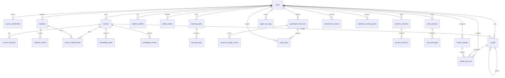

# EduNova 数据库设计

日期：2026-07-01

## 1. 设计目标

EduNova 数据库设计服务于学生个性化学习闭环。第一版需要同时支持内置示例课程、用户上传建课、RAG 检索、多智能体轨迹、学习画像、学习路径和练习评估。

设计原则：

1. 所有用户私有数据绑定 `user_id`。
2. 所有课程内学习数据绑定 `course_id`，但用户资料库资料可以先只绑定 `user_id`，再通过关联表加入课程。
3. 所有 AI 任务绑定 `trace_id`。
4. 生成内容必须可追溯引用来源。
5. JSON 字段用于保存灵活 AI 结构，但核心查询字段保持结构化。
6. 第一版结构为后续教师端、班级和课程包扩展预留空间。

## 2. 数据库技术

| 能力 | 技术 |
| --- | --- |
| 关系数据 | PostgreSQL |
| 向量检索 | pgvector |
| ORM | SQLAlchemy |
| 迁移 | Alembic |
| 长任务进度 | Redis |
| 文件内容 | 本地文件存储，数据库保存路径和元数据 |

当前 Phase 2A/2B/2C 已落地：

- `backend/app/core/config.py`：读取数据库和 Redis 配置。
- `backend/app/db/base.py`：SQLAlchemy metadata 入口。
- `backend/app/db/session.py`：engine 与 Session 工厂。
- `backend/app/models`：核心业务模型和学习闭环基础模型。
- `backend/app/data/builtin_courses/data_structures/`：数据结构与算法结构化内置课程包。
- `backend/app/data/builtin_courses/data_structures.py`：课程包加载、数量、先修 DAG、重复与占位内容校验器。
- `backend/app/services/course_seed.py`：内置课程导入服务。
- `backend/migrations`：Alembic 迁移目录。
- `backend/migrations/versions/20260701_0001_enable_pgvector.py`：启用 pgvector 扩展。
- `backend/migrations/versions/20260701_0002_create_core_learning_tables.py`：创建用户、课程、选课、资料、知识点和知识切片表。
- `backend/migrations/versions/20260701_0003_create_learning_closure_tables.py`：创建画像、学习路径、生成资源、Agent 轨迹、练习、报告、对话和模型设置基础表。
- `backend/migrations/versions/20260701_0004_add_user_starter_mode.py`：创建注册初始化方式字段。
- `backend/migrations/versions/20260703_0005_create_material_library.py`：创建独立个人资料库 `materials` 和课程资料关联表 `course_material_links`，并从旧 `course_materials` 兼容回填。
- `backend/migrations/versions/20260707_0008_create_export_jobs.py`：创建异步学习档案导出任务表 `export_jobs`。
- `backend/migrations/versions/20260710_0009_create_material_chunks.py`：创建主页资料级 RAG 使用的 `material_chunks`、资料内顺序唯一约束和 pgvector cosine 索引。
- `backend/migrations/versions/20260710_0010_add_resource_export_jobs.py`：为 `export_jobs` 增加 nullable `resource_id` 外键和资源状态索引，用于 PPTX 文件任务。
- `backend/migrations/versions/20260711_0014_create_ai_jobs.py`：创建统一 AI 长任务表 `ai_jobs`，用于智能建课和资源生成的状态、进度、幂等、取消和重试。
- `backend/migrations/versions/20260711_0015_create_model_call_runs.py`：创建隐私安全模型调用审计表 `model_call_runs`，不保存 Prompt、回答、资料原文或密钥。
- `backend/migrations/versions/20260712_0016_add_chat_session_material_context.py`：为主页会话增加会话级参考资料 ID 数组，默认空数组。
- `backend/migrations/versions/20260713_0017_complete_settings_center.py`：为模型配置增加回答/向量独立安全测试摘要，并为用户增加认证版本，支持换密后旧 JWT 失效。
- `backend/migrations/versions/20260714_0022_replace_email_with_account.py`：将邮箱登录迁移为不区分大小写的独立账号登录；旧邮箱仅用于生成唯一账号，迁移完成后删除邮箱字段。
- `backend/migrations/versions/20260713_0018_split_model_defaults.py`：为模型配置增加独立向量默认标记；旧回答默认中已配置向量模型的记录自动继承向量默认。
- `backend/migrations/versions/20260713_0019_split_embedding_connection.py`：为同一模型配置增加向量专用 Provider 预设、Base URL 和加密 Key；旧非空向量配置从共享连接兼容复制。
- `backend/migrations/versions/20260713_0020_dynamic_embedding_and_rerank.py`：把课程/资料向量列升级为动态维度，增加向量配置指纹字段，并为模型配置增加讯飞向量凭证与独立重排序连接。

Phase 4.2 的 `/dashboard/summary` 不新增表和字段，只读取当前已有数据并整理为首页总览响应。Phase 4.4 后，资料库摘要和最近资料列表改为读取独立 `materials`，未归属数量通过 `course_material_links` 计算。

## 3. 核心关系图



## 4. 表设计

### 4.1 `users`

用途：保存用户账号。

核心字段：

| 字段 | 类型 | 说明 |
| --- | --- | --- |
| `id` | bigint | 主键 |
| `account` | varchar(24) | 登录账号，唯一、统一小写、创建后不可修改 |
| `hashed_password` | varchar | 加密密码 |
| `display_name` | varchar | 显示名称 |
| `role` | varchar | `student` 或 `admin` |
| `starter_mode` | varchar | 注册初始化方式，`blank` 或 `data_structures` |
| `auth_version` | integer | JWT 认证版本，修改密码后递增，非空默认 `0` |
| `created_at` | timestamptz | 创建时间 |
| `updated_at` | timestamptz | 更新时间 |

约束：

- `account` 唯一，长度 4–24 位，以字母或数字开头，仅允许小写英文字母、数字和下划线。
- 第一版默认 `role=student`。
- 旧用户迁移默认 `starter_mode=blank`；新注册未传时服务层保持 `blank`。
- 历史 JWT 缺少认证版本声明时按 `0` 兼容；密码修改后数据库版本递增，所有旧版本令牌失效。

### 4.2 `courses`

用途：保存内置课程和用户上传生成的课程。

核心字段：

| 字段 | 类型 | 说明 |
| --- | --- | --- |
| `id` | bigint | 主键 |
| `owner_id` | bigint | 创建者，内置课程可为空或指向系统用户 |
| `title` | varchar | 课程名称 |
| `description` | text | 课程说明 |
| `subject` | varchar | 学科 |
| `source_type` | varchar | `builtin`、`uploaded`、`demo` |
| `visibility` | varchar | `private`、`public` |
| `status` | varchar | `draft`、`ready`、`failed` |
| `agent_trace_id` | varchar | 建课 Graph 轨迹，可为空 |
| `structure_json` | jsonb | v2 课程结构、学习目标、章节、来源覆盖和审核摘要，非空默认 `{}` |
| `created_at` | timestamptz | 创建时间 |

### 4.3 `course_enrollments`

用途：记录用户和课程关系。

字段：

| 字段 | 类型 | 说明 |
| --- | --- | --- |
| `id` | bigint | 主键 |
| `user_id` | bigint | 用户 |
| `course_id` | bigint | 课程 |
| `role` | varchar | 第一版为 `learner` |
| `progress_percent` | numeric | 进度 |
| `created_at` | timestamptz | 创建时间 |

唯一约束：

- `user_id + course_id` 唯一。

### 4.4 `course_materials`

用途：保存早期课程资料和内置课程知识切片来源。

当前已落地的 Phase 2 表结构把资料直接绑定到课程，`course_id` 为必填。Phase 3 重定向后，产品规则调整为“资料库独立于课程，资料可以加入一个或多个课程”。Phase 4.4 已完成兼容迁移：

```text
materials              独立资料库，绑定 user_id，不强制绑定 course_id
course_material_links  课程与资料的关联表，支持同一资料加入多个课程
knowledge_chunks       仍绑定 course_id，同时引用 material_id
```

迁移后，`course_materials` 暂时保留，用于兼容内置课程和已有 `knowledge_chunks.material_id` 关系；新上传资料写入 `materials`，加入课程时写入 `course_material_links`。Phase 13.2 后，从已解析 TXT/Markdown/PDF/DOCX/PPTX 资料生成课程时，会为新课程创建兼容旧链路的 `course_materials` 副本，同时用 `course_material_links.usage_type=course_source` 关联原个人资料库资料，保证后续 RAG 可以沿 `knowledge_chunks -> course_materials` 接入。

Phase 16 的 `MaterialComparisonGraph` 继续复用 `materials`、`course_material_links`、`material_chunks` 和课程切片收集真实证据，但审核后的安全结果会写入不可变的 `material_comparison_runs`。记录只保存资料 ID、短引用和结构化结论，不保存完整资料原文、系统提示词、模型输入或 API Key。

字段：

| 字段 | 类型 | 说明 |
| --- | --- | --- |
| `id` | bigint | 主键 |
| `user_id` | bigint | 上传者 |
| `course_id` | bigint | 所属课程 |
| `filename` | varchar | 原文件名 |
| `content_type` | varchar | 文件类型 |
| `storage_path` | text | 文件存储路径 |
| `parse_status` | varchar | 解析状态 |
| `extracted_text` | text | 提取文本 |
| `metadata_json` | jsonb | 页码、标题、字数等元数据 |
| `agent_trace_id` | varchar | 建课或资料处理 Graph 轨迹，可为空 |
| `created_at` | timestamptz | 创建时间 |

### 4.4.1 `materials`

用途：保存用户上传到个人资料库的原始资料和解析状态。Phase 21 后，`.txt`、`.md`、`.pdf`、`.docx`、`.pptx` 通过 `MaterialIngestionGraph` 生成版本化目录和章节切片；质量通过后进入待确认，用户确认后才能用于生产检索和建课。旧版 `.doc`、`.ppt`、图片和扫描件不做深度解析。

字段：

| 字段 | 类型 | 说明 |
| --- | --- | --- |
| `id` | bigint | 主键 |
| `user_id` | bigint | 上传者 |
| `filename` | varchar | 原文件名 |
| `content_type` | varchar | 文件类型 |
| `storage_path` | text | 文件存储路径 |
| `parse_status` | varchar | 解析状态 |
| `extracted_text` | text | 提取文本 |
| `metadata_json` | jsonb | 页码、标题、字数等元数据 |
| `agent_trace_id` | varchar | 上传解析或资料 Graph 轨迹，可为空 |
| `ingestion_status` | varchar | `pending/running/awaiting_confirmation/confirmed/failed/legacy` |
| `parser_version` | varchar | 当前解析器协议版本 |
| `content_hash` | varchar | 原文件内容安全哈希 |
| `outline_version` | integer | 当前目录结构版本 |
| `outline_json` | jsonb | 章节树、包含状态和版本化编辑结果 |
| `quality_json` | jsonb | 可读率、异常字符、重复率、页码与 warning 摘要 |
| `parsed_at` | timestamptz | 最近一次深度解析完成时间，可空 |
| `created_at` | timestamptz | 创建时间 |
| `updated_at` | timestamptz | 更新时间 |

约束与索引：

- `user_id` 外键指向 `users.id`。
- `ix_materials_user_status_created(user_id, parse_status, created_at)` 支持用户资料库列表和状态筛选。

### 4.4.2 `material_chunks`

用途：保存已确认资料的章节保真检索切片，供主页资料问答、资料对比和智能建课共同使用。切片只在章节内部组合，目标 300 至 900 字、硬上限 1200 字，不跨章节重叠。

| 字段 | 类型 | 说明 |
| --- | --- | --- |
| `id` | bigint | 主键 |
| `material_id` | bigint | 来源资料，删除资料时级联删除切片 |
| `chunk_index` | integer | 资料内稳定顺序 |
| `section_title` | varchar | Markdown 标题或解析章节，可空 |
| `page_number` | integer | 来源页码，可空 |
| `end_page_number` | integer | 结束页码，可空 |
| `section_path_json` | jsonb | 从顶层章节到当前小节的路径 |
| `chunk_type` | varchar | 正文、标题、表格或其他安全类型 |
| `content` | text | 检索正文 |
| `content_hash` | varchar | 切片正文哈希，用于去重和版本校验 |
| `quality_json` | jsonb | 页码、长度、异常字符和重复诊断摘要 |
| `embedding` | vector | 当前配置生成的动态维度外部向量，可空 |
| `embedding_provider` | varchar | 向量 Provider，可空；旧向量为空 |
| `embedding_model` | varchar | 向量模型，可空 |
| `embedding_dimension` | integer | 实际维度，可空 |
| `embedding_profile_hash` | varchar | Provider、模型、维度和连接配置的安全指纹，可空 |
| `embedding_updated_at` | timestamptz | 最近向量更新时间，可空 |
| `metadata_json` | jsonb | 来源文件名、embedding 来源/模型/维度/时间等安全元数据 |
| `created_at` | timestamptz | 创建时间 |

约束与索引：

- `material_id + chunk_index` 唯一。
- `material_id` 外键指向 `materials.id`，`ON DELETE CASCADE`。
- `ix_material_chunks_material(material_id)` 支持选中资料范围检索。
- `ix_material_chunks_material_embedding_profile(material_id, embedding_profile_hash)` 支持当前配置精确检索。
- `ix_material_chunks_material_section(material_id, section_title, page_number)` 支持资料检查器和章节范围读取。
- 查询先按当前用户资料所有权、本次 `selected_material_ids`、Provider、模型、维度和配置指纹限定候选，再融合关键词、cosine 与可选重排序；不返回完整资料原文。

### 4.4.3 `course_material_links`

用途：记录资料与课程的关联，支持同一资料进入多个课程。

字段：

| 字段 | 类型 | 说明 |
| --- | --- | --- |
| `id` | bigint | 主键 |
| `course_id` | bigint | 课程 |
| `material_id` | bigint | 资料 |
| `added_by_user_id` | bigint | 添加者 |
| `usage_type` | varchar | `reference`、`course_source`、`exam_review` 等 |
| `created_at` | timestamptz | 创建时间 |

唯一约束：

- `course_id + material_id` 唯一。

约束与索引：

- `course_id` 外键指向 `courses.id`。
- `material_id` 外键指向 `materials.id`。
- `added_by_user_id` 外键指向 `users.id`。
- `ix_course_material_links_course(course_id)`。
- `ix_course_material_links_material(material_id)`。

### 4.4.4 `material_comparison_runs`

用途：保存 `MaterialComparisonGraph` 审核后的不可变资料对比版本，支持最近结果恢复和 trace 追溯。资料对比结果保持独立，不自动进入路径或练习。

| 字段 | 类型 | 说明 |
| --- | --- | --- |
| `id` | bigint | 主键，也是公共 `comparison_id` |
| `user_id` | bigint | 当前用户，删除用户时级联删除 |
| `course_id` | bigint | 当前课程，删除课程时级联删除 |
| `material_ids_json` | jsonb | 本次对比资料 ID 列表 |
| `result_json` | jsonb | 审核后的安全结论、短引用、warning 与 review 摘要 |
| `agent_trace_id` | varchar | 真实 `MaterialComparisonGraph` trace，非空 |
| `generation_mode` | varchar | `model_enhanced` 或 `deterministic_source` |
| `review_mode` | varchar | `model_and_rules` 或 `rules_only` |
| `created_at` | timestamptz | 版本创建时间 |

索引：`(user_id, course_id, created_at)` 用于最近版本恢复，`agent_trace_id` 用于 Graph 追溯。重新对比新增记录，不覆盖旧版本。

### 4.5 `knowledge_points`

用途：课程知识点。Phase 15 的 CourseBuilderGraph 根据真实资料分块生成知识点，并把临时先修 key 在事务落库后转换为真实知识点 ID；旧课程继续兼容空先修关系。

字段：

| 字段 | 类型 | 说明 |
| --- | --- | --- |
| `id` | bigint | 主键 |
| `course_id` | bigint | 课程 |
| `title` | varchar | 知识点名称 |
| `summary` | text | 摘要 |
| `chapter` | varchar | 所属章节 |
| `order_index` | integer | 排序 |
| `difficulty` | varchar | 难度 |
| `prerequisites_json` | jsonb | 前置知识点 |

### 4.6 `knowledge_chunks`

用途：RAG 检索切片。已解析 TXT/Markdown/PDF/DOCX/PPTX 资料按知识点切成文本片段；Alembic `0020` 后保存当前默认配置生成的动态维度外部向量。

字段：

| 字段 | 类型 | 说明 |
| --- | --- | --- |
| `id` | bigint | 主键 |
| `course_id` | bigint | 课程 |
| `material_id` | bigint | 来源资料 |
| `knowledge_point_id` | bigint | 对应知识点 |
| `content` | text | 切片内容 |
| `page_number` | integer | 页码 |
| `section_title` | varchar | 小节标题 |
| `embedding` | vector | 动态维度向量，可为空 |
| `embedding_provider` | varchar | 向量 Provider，可空 |
| `embedding_model` | varchar | 向量模型，可空 |
| `embedding_dimension` | integer | 实际向量维度，可空 |
| `embedding_profile_hash` | varchar | 当前连接配置的安全指纹，可空 |
| `embedding_updated_at` | timestamptz | 最近向量更新时间，可空 |
| `metadata_json` | jsonb | 来源和兼容向量元数据 |

索引：

- `course_id`。
- `knowledge_point_id`。
- `course_id + embedding_profile_hash` 组合索引；混合维度范围内使用精确 cosine 检索，不创建 IVFFlat 索引。

### 4.7 `student_profiles`

用途：保存学生当前画像。

字段：

| 字段 | 类型 | 说明 |
| --- | --- | --- |
| `id` | bigint | 主键 |
| `user_id` | bigint | 用户 |
| `profile_json` | jsonb | 8 维画像 |
| `confidence_score` | numeric | 当前画像可信度 |
| `dimension_confidence_json` | jsonb | 8 个画像维度的逐维可信度，非空默认 `{}` |
| `updated_reason` | text | 最近一次更新原因摘要 |
| `created_at` | timestamptz | 创建时间 |
| `updated_at` | timestamptz | 更新时间 |

Phase 7.1 复用本表保存当前用户真实 8 维画像，不新增 `version` 字段；接口返回的 `version` 由当前画像关联的 `profile_events` 数量派生。

Phase 7.2 明确本表保存用户级长期画像，只保留一份，不为每门课程复制完整画像。专业背景、认知风格、学习偏好、学习节奏和长期目标优先放在这里；课程级目标、薄弱点、掌握度、复习队列和路径依据通过课程相关表或后续聚合接口表达。

### 4.8 `profile_events`

用途：记录画像变化证据链。

字段：

| 字段 | 类型 | 说明 |
| --- | --- | --- |
| `id` | bigint | 主键 |
| `user_id` | bigint | 用户 |
| `profile_id` | bigint | 对应画像，可为空 |
| `dimension` | varchar | 画像维度 |
| `change_summary` | text | 变化摘要 |
| `evidence_json` | jsonb | 证据引用和触发来源 |
| `agent_trace_id` | varchar | ProfileGraph 轨迹，可为空 |
| `source_type` | varchar | `profile_chat`、`course_tutor`、`practice_assessment` 等安全来源 |
| `source_ref_type` | varchar | 来源实体类型，可为空 |
| `source_ref_id` | bigint | 来源实体 ID，可为空 |
| `status` | varchar | `candidate` 或 `applied` |
| `confidence_score` | numeric | 本次提案聚合可信度，可为空 |
| `proposal_json` | jsonb | 白名单画像提案，非空默认 `{}` |
| `applied_at` | timestamptz | 应用到长期画像的时间，可为空 |
| `created_at` | timestamptz | 创建时间 |

Phase 7.1 中课程问答只会在 `scope=course` 且用户问题出现明确困惑或薄弱信号时写入 `dimension="weak_points"` 的画像候选事件。`evidence_json` 只保存来源类型、课程 ID、会话 ID、消息 ID、trace ID 和安全引用摘要，不保存完整用户问题、系统提示词、模型输入或资料原文。

Phase 7.2 明确 `profile_events` 是证据流，不等同于正式弱点或学习事件总线。带课程来源的事件可作为课程学习状态候选证据，后续是否进入 `weakness_review_queue` 需要去重、合并或用户/练习结果确认。本阶段不新增通用 `learning_events` 表。

Phase 7.3 中 `GET /courses/{course_id}/learning-state` 会读取当前用户当前课程下的弱点候选事件，并按知识点或安全标题同步到 `weakness_review_queue` 的 `pending` 项。该同步不读取完整用户问题、系统提示词、模型输入或资料原文。

Phase 15 的迁移 `20260710_0012` 为画像与课程结构补齐上述字段。显式画像回答写 `applied`；隐式学习信号在双来源和置信度门槛前写 `candidate`，不保存完整问答、作答或模型输入。

### 4.9 `learning_paths`

用途：保存学习路径。

Phase 7.2 明确学习路径是课程级能力，后续应基于课程学习状态、弱点复习队列、课程知识点和用户级画像生成；不只根据全局画像生成。

Phase 9 开始实际复用本表保存课程级学习路径，不新增迁移。生成新路径时，服务层会把同一用户同一课程旧 `active` 路径归档为 `archived`，再写入新的 `active` 路径。`plan_json` 只保存安全摘要、生成规则、计数、依据说明和可展示 metadata，不保存系统提示词、模型输入、API Key、完整课程资料原文或完整用户画像原文。

当前普通路径使用 `plan_json.schema_version=4` 和 `path_mode="ordered"`。系统根据画像目标、弱点、掌握度、课程知识点和资源证据生成有序任务，不生成日期或期限；练习回流保留已完成进度并生成新的 active 路径。历史 v2/v3 与 `sprint_active/sprint_archived` 行保持原样，不删除、不迁移，也不再由业务接口读取或更新。

字段：

| 字段 | 类型 | 说明 |
| --- | --- | --- |
| `id` | bigint | 主键 |
| `user_id` | bigint | 用户 |
| `course_id` | bigint | 课程 |
| `title` | varchar | 路径标题 |
| `goal` | text | 学习目标 |
| `status` | varchar | 状态 |
| `plan_json` | jsonb | 路径结构 |
| `agent_trace_id` | varchar | `PathPlanningGraph` 轨迹，可为空 |
| `created_at` | timestamptz | 创建时间 |
| `updated_at` | timestamptz | 更新时间 |

### 4.10 `learning_tasks`

用途：路径中的学习任务。

Phase 9 开始实际复用本表保存课程级路径任务。任务来源按 `reviewing` 弱点、`confirmed` 弱点、未覆盖知识点排序；`pending` 和 `dismissed` 弱点不进入路径任务。普通路径任务类型固定为 `review`、`learn`、`resource`，任务状态固定为 `todo`、`doing`、`completed`；第一条任务为 `doing`，其余为 `todo`。`recommended_resource_ids` 最多保存 3 个同课程资源 ID，优先匹配同知识点资源，没有知识点时按安全标题匹配。

历史冲刺任务可能仍保留 `sprint_review`、`sprint_practice`、`sprint_resource` 类型，但生产代码不再创建、读取或更新这些任务。

字段：

| 字段 | 类型 | 说明 |
| --- | --- | --- |
| `id` | bigint | 主键 |
| `path_id` | bigint | 学习路径 |
| `user_id` | bigint | 用户 |
| `course_id` | bigint | 课程 |
| `knowledge_point_id` | bigint | 知识点 |
| `title` | varchar | 任务标题 |
| `task_type` | varchar | 当前路径使用 `review`、`learn`、`resource`；历史数据可能包含已退役的 `sprint_*` 类型 |
| `reason` | text | 推荐理由 |
| `recommended_resource_ids` | jsonb | 推荐资源 ID 列表 |
| `status` | varchar | `todo`、`doing`、`completed` |
| `due_at` | timestamptz | 历史兼容字段；当前学习路径不再写入、排序或返回 |
| `next_review_at` | timestamptz | 历史兼容字段；当前学习路径不再写入或返回，弱点复习时间由 `weakness_review_queue` 管理 |

### 4.11 `generated_resources`

用途：保存 AI 生成学习资源。

该表现在保存六类课程资源：`doc`、`mindmap`、`quiz`、`code`、`slide`、`animation`。Phase 19 新产物使用 `content_json.schema_version=3`，Phase 20 在同一协议中扩展教学意图、个性化说明、差异检测和多维质量结果。Alembic `20260714_0021` 增加不可覆盖的版本族；历史 v1/v2 和无版本字段的旧资源不批量改写。资源分层仍为 `course_id != null` 表示课程资源，`course_id == null` 预留个人全局资源。

服务层必须保证：

- 新建课程资源时强制写入当前用户自己的 `user_id` 和非空 `course_id`。
- `knowledge_point_id` 若存在，必须属于同一课程。
- `citation_json` 只保存安全引用摘要，不保存完整课程资料原文。
- `content_json` 不保存系统提示词、完整模型输入、API Key 或完整用户画像原文。
- `content_json.metadata.generation_mode` 区分模型增强和确定性来源，`review_mode` 区分模型加规则审核与纯规则审核，`repair_count` 只允许 0 或 1。
- 模型未配置或调用失败时可以写入确定性可用稿；只要课程依据和资源必备结构足够，`review_status` 仍可为 `passed`。
- `review_status="low_evidence"` 只表示课程依据不足或只能生成低依据稿，不等同于模型未调用或模型失败。
- 新建资源独立形成版本族并写入版本 `1`；替代或优化版本继承来源版本族、递增版本号并记录直接来源。版本号分配锁定整个版本族，避免并发生成重复版本。
- 历史版本永久保留。新版本审核失败时不得创建空版本，也不得覆盖或归档来源版本。

字段：

| 字段 | 类型 | 说明 |
| --- | --- | --- |
| `id` | bigint | 主键 |
| `user_id` | bigint | 用户 |
| `course_id` | bigint | 课程 |
| `knowledge_point_id` | bigint | 知识点 |
| `resource_type` | varchar | 资源类型 |
| `title` | varchar | 标题 |
| `content_json` | jsonb | 结构化内容 |
| `citation_json` | jsonb | 引用来源 |
| `status` | varchar | 生成状态 |
| `review_status` | varchar | 审核状态 |
| `confidence_score` | numeric | 可信度 |
| `agent_trace_id` | varchar | ResourceGenerationGraph 轨迹，可为空 |
| `version_family_id` | varchar(36) | 版本族 ID；legacy 资源可为空 |
| `revision_of_resource_id` | bigint | 直接来源版本，自引用外键，删除来源时置空 |
| `version_number` | integer | 版本族内递增序号；legacy 资源可为空 |
| `generation_action` | varchar(20) | `new`、`alternative` 或 `refine`，默认 `new` |
| `created_at` | timestamptz | 创建时间 |
| `updated_at` | timestamptz | 更新时间 |

### 4.12 `resource_quality_scores`

用途：保存资源质量评分。

Phase 8.2 生成资源时同步写入质量分。基础五项为 `source_match`、`profile_fit`、`fact_confidence`、`difficulty_fit`、`completeness`；Phase 20 增加 `authenticity`、`personalization`、`diversity`、`pedagogical_utility` 和 `type_correctness`。评分说明只保存可展示的安全摘要，不保存模型提示词、完整资料原文或用户隐私原文。

字段：

| 字段 | 类型 | 说明 |
| --- | --- | --- |
| `id` | bigint | 主键 |
| `resource_id` | bigint | 资源 |
| `score_name` | varchar | 评分项名称 |
| `score_value` | numeric | 评分值 |
| `rationale` | text | 评分说明 |
| `created_at` | timestamptz | 创建时间 |

### 4.13 `agent_run_logs`

用途：保存多智能体轨迹。

该表提供 `/agents/traces/{trace_id}` 查询。资源生成会记录 `profile`、`retrieve`、`diagnosis`、`planner`、多个类型 Worker、`aggregate`、`ReviewAgent`、可选 `RepairAgent` 和 `persist`；并行 Worker 共享步骤序号但各自保存真实耗时。课程问答保持 `profile`、`retriever`、`tutor`、`weakness`、`review`、`next_action`。响应只返回白名单摘要。

字段：

| 字段 | 类型 | 说明 |
| --- | --- | --- |
| `id` | bigint | 主键 |
| `trace_id` | varchar | 任务编号 |
| `user_id` | bigint | 用户 |
| `course_id` | bigint | 课程 |
| `agent_name` | varchar | Agent 名称 |
| `step_index` | integer | 步骤 |
| `status` | varchar | 状态 |
| `input_summary` | text | 输入摘要 |
| `output_summary` | text | 输出摘要 |
| `duration_ms` | integer | 耗时 |
| `metadata_json` | jsonb | 安全摘要、引用摘要和补充元数据 |
| `created_at` | timestamptz | 创建时间 |

索引：

- `trace_id`。
- `user_id`。
- `course_id`。

### 4.14 `practice_sessions`

用途：保存一次练习。

Phase 14 的迁移 `20260710_0011` 新增 `assessment_json`，持久化弱点新增/更新数、路径回流状态、路径 trace 和推荐资源 ID。练习必须绑定 `user_id` 和 `course_id`，只能由当前用户访问。

Phase 15 继续复用 `assessment_json` 保存 `requested_difficulty`、`effective_difficulty` 和 `draft_saved_at`。草稿写在已有 `practice_answers.answer_text`，不新增草稿表，也不触发评估。

字段：

| 字段 | 类型 | 说明 |
| --- | --- | --- |
| `id` | bigint | 主键 |
| `user_id` | bigint | 用户 |
| `course_id` | bigint | 课程 |
| `title` | varchar | 练习标题 |
| `status` | varchar | 进行中、已完成 |
| `score` | numeric | 得分 |
| `agent_trace_id` | varchar | AssessmentGraph 轨迹，可为空 |
| `assessment_json` | jsonb | 闭环回流摘要，非空，默认 `{}` |
| `created_at` | timestamptz | 创建时间 |
| `updated_at` | timestamptz | 更新时间 |

### 4.15 `practice_answers`

用途：保存每道题作答和批改。

创建练习时先写入 `answer_text=null`、`is_correct=null` 的稳定占位行，用 `question_json` 保存安全题目结构；提交答案时更新原行而不是删除重建，使错题证据可精确引用同一个 `PracticeAnswer.id`。数字评分确定性写入 `feedback_json`，可同时保存脱敏错因、缺失概念、复习动作和置信度。

字段：

| 字段 | 类型 | 说明 |
| --- | --- | --- |
| `id` | bigint | 主键 |
| `session_id` | bigint | 练习 |
| `user_id` | bigint | 用户 |
| `question_json` | jsonb | 题目 |
| `answer_text` | text | 学生答案 |
| `is_correct` | boolean | 是否正确 |
| `feedback_json` | jsonb | 批改反馈 |
| `created_at` | timestamptz | 创建时间 |

### 4.16 `assessment_reports`

用途：保存学习评估报告。

Phase 10 开始实际复用本表保存课程学习报告，不新增迁移。报告基于课程、可选练习、弱点队列和掌握度摘要生成，`report_json` 只保存可展示摘要、证据引用、下一步建议和复习队列更新摘要，不保存完整用户画像原文、完整课程资料原文、系统提示词、模型输入或 API Key。

字段：

| 字段 | 类型 | 说明 |
| --- | --- | --- |
| `id` | bigint | 主键 |
| `user_id` | bigint | 用户 |
| `course_id` | bigint | 课程 |
| `practice_session_id` | bigint | 来源练习，可为空 |
| `report_json` | jsonb | 报告内容 |
| `score` | numeric | 综合得分 |
| `agent_trace_id` | varchar | ReportGraph 轨迹，可为空 |
| `created_at` | timestamptz | 创建时间 |

### 4.17 `weakness_review_queue`

用途：保存薄弱点复习队列。

Phase 7.2 明确本表承载课程级可执行复习任务。每个复习项必须绑定 `course_id`，候选来源可以来自画像事件、课程问答或练习评估，但进入队列前必须去重或合并，避免同一知识点反复生成多条任务。

Phase 7.3 复用本表，不新增迁移。虽然历史模型允许 `course_id` 为空，本阶段服务层强制课程问答候选事件入队时写入非空 `course_id`；`source_type="course_question"`，`status="pending"` 表示待确认/待复习，不表示系统已经完成正式诊断。

Phase 7.4 继续不新增迁移，复用 `status` 字段承载队列状态流转：`pending` 表示待确认，`confirmed` 表示学生已确认待复习，`reviewing` 表示复习中，`completed` 表示已完成本轮复习，`dismissed` 表示软忽略/移出主列表。`dismissed` 不物理删除，仍参与课程内去重，避免同一课程问答候选事件在下次 `learning-state` 同步时重新入队。

Phase 9 继续复用本表，不新增字段。`GET /courses/{course_id}/learning-state` 会为 `confirmed/reviewing/completed` 项确定性补充同课程推荐资源：优先同知识点资源，没有知识点时按安全标题匹配，每项最多 3 个资源 ID。`pending` 项仍只表达待确认语义，不直接进入学习路径。`complete` 操作后会设置下一次复习时间；`confirmed/reviewing` 项缺少 `next_review_at` 时，学习状态读取可补齐确定性复习时间。推荐资源和复习时间只写已有 `recommended_resource_ids` 与 `next_review_at` 字段。

Phase 10 继续复用本表，不新增字段。练习评估中的错题或低分题会以 `source_type="practice_assessment"` 写入课程级 `confirmed` 复习项，因为它来自学生真实作答证据；课程问答候选事件仍保持 `pending` 待确认语义。练习来源入队按同课程同知识点或安全标题去重，不保存完整答案之外的隐私资料原文、系统提示词或模型输入。

Phase 14 的迁移 `20260710_0011` 增加安全来源引用和诊断字段。同一知识点再次答错时更新已有队列项的诊断、证据列表和计数，不重复创建队列项；证据 ID 最多保留 5 个。

字段：

| 字段 | 类型 | 说明 |
| --- | --- | --- |
| `id` | bigint | 主键 |
| `user_id` | bigint | 用户 |
| `course_id` | bigint | 课程 |
| `knowledge_point_id` | bigint | 薄弱知识点 |
| `title` | varchar | 复习项标题 |
| `source_type` | varchar | 来源类型 |
| `source_ref_type` | varchar | 精确证据类型，可为空 |
| `source_ref_id` | bigint | 精确证据 ID，可为空 |
| `diagnosis_json` | jsonb | 错因、缺失概念、动作、置信度和安全证据 ID，默认 `{}` |
| `status` | varchar | `pending`、`confirmed`、`reviewing`、`completed`、`dismissed` |
| `recommended_resource_ids` | jsonb | 推荐资源 |
| `next_review_at` | timestamptz | 下次复习时间 |
| `created_at` | timestamptz | 创建时间 |
| `updated_at` | timestamptz | 更新时间 |

### 4.18 `chat_sessions` 与 `chat_messages`

用途：保存 AI 辅导会话。

Phase 3 重定向后，会话需要区分主页会话和课程会话：

- 主页会话：`scope=home`，`course_id` 可以为空。
- 课程会话：`scope=course`，`course_id` 必填。
- 主页会话可以移入课程，移入后可设置 `archived_from_home=true` 或记录迁移事件。

`chat_sessions`：

- `id`。
- `user_id`。
- `scope`。
- `course_id`，主页会话可为空。
- `title`。
- `mode`。
- `archived_from_home`。
- `selected_material_ids`，JSONB，默认 `[]`；只保存当前用户已解析资料 ID，最多 10 项，课程会话保持空数组。
- `created_at`。

`chat_messages`：

- `id`。
- `session_id`。
- `user_id`。
- `role`。
- `content`。
- `citation_json`。
- `trace_id`。
- `created_at`。

### 4.19 `model_settings`

用途：保存用户模型设置。Phase 6.1 复用本表完成一人一套配置；Phase 6.2 通过 Alembic `20260704_0006` 扩展为同一用户多套配置，去掉 `user_id` 唯一限制，用户 API Key 使用 Fernet 加密后写入 `api_key_ciphertext`，系统 `.env` 模型配置不写入本表。

字段：

| 字段 | 类型 | 说明 |
| --- | --- | --- |
| `id` | bigint | 主键 |
| `user_id` | bigint | 用户 |
| `display_name` | varchar | 当前用户内的配置名称 |
| `preset_id` | varchar | 前端 Provider 预设标识，如 `spark`、`deepseek`、`ollama` |
| `provider` | varchar | 模型协议供应商，当前统一为 `openai_compatible` |
| `base_url` | text | 回答接口地址，讯飞 Spark X2-Flash 为 `https://spark-api-open.xf-yun.com/agent/v1/` |
| `api_key_ciphertext` | text | 加密后的 API Key |
| `chat_model` | varchar | 聊天模型 |
| `embedding_provider` | varchar | `openai_compatible` 或 `xfyun_embedding` |
| `embedding_preset_id` | varchar | 可空向量 Provider 预设标识，可与回答预设不同 |
| `embedding_base_url` | text | 可空向量接口地址，可与回答地址不同 |
| `embedding_api_key_ciphertext` | text | 可空向量 API Key 密文，与回答 Key 独立加密 |
| `embedding_app_id_ciphertext` | text | 讯飞向量 APPID 密文，可空 |
| `embedding_api_secret_ciphertext` | text | 讯飞向量 APISecret 密文，可空 |
| `embedding_model` | varchar | 可空向量模型；缺省时使用关键词检索 fallback |
| `embedding_dimension` | integer | 连接测试识别或预设确认的实际维度，可空 |
| `rerank_provider` | varchar | 可空重排序协议供应商 |
| `rerank_preset_id` | varchar | 可空重排序预设标识 |
| `rerank_base_url` | text | 可空重排序地址 |
| `rerank_api_key_ciphertext` | text | 可空重排序 Key 密文 |
| `rerank_model` | varchar | 可空重排序模型 |
| `rerank_workspace_id` | varchar | 百炼 Workspace ID，可空 |
| `tool_flags_json` | jsonb | 预留工具标记，当前设置页不管理联网搜索或深度思考 |
| `is_default` | boolean | 是否为当前用户回答默认配置，保留旧字段名兼容 |
| `is_embedding_default` | boolean | 是否为当前用户向量默认配置 |
| `is_rerank_default` | boolean | 是否为当前用户重排序默认配置 |
| `last_test_ok` | boolean | 最近一次连接测试是否成功 |
| `last_test_message` | text | 最近一次连接测试的脱敏结果摘要 |
| `last_tested_at` | timestamptz | 最近一次连接测试时间 |
| `connection_test_json` | jsonb | 回答/向量/重排序独立安全测试摘要，非空默认 `{}` |
| `created_at` | timestamptz | 创建时间 |
| `updated_at` | timestamptz | 更新时间 |

要求：

- 不保存明文 Key。
- 日志不记录 Key。
- 前端只显示脱敏 Key。
- 回答、向量或重排序连接未变化时，空 Key 会保留原密钥；Provider 或 Base URL 变化时必须重新提供对应 Key，否则清除旧密文。
- 缺少 `MODEL_SETTINGS_ENCRYPTION_KEY` 时，不允许保存新的用户 Key。
- 同一用户可保存多套配置；每套配置可组合不同回答、向量和重排序服务商。三类运行时分别读取自己的默认标记，某一用途缺失时独立回退服务器 `.env`。
- 删除默认配置后，后端只在包含对应模型的剩余配置中选择该用途的新默认。
- 设置页回答预设首位为讯飞 Spark X2-Flash；向量和重排序预设可使用各自原生协议，不能伪装为聊天接口。
- `connection_test_json` 只保存操作类型、模型名、成功状态、安全错误分类、是否可重试和测试时间；不保存 Prompt、回答、向量、密钥或 Provider 原始错误。旧 `last_test_*` 继续兼容回答模型最近测试。
- `20260704_0006` 迁移为旧数据补 `display_name` 和 `is_default=true`，保证 Phase 6.1 的旧单配置继续可用。
- `20260713_0018` 将旧回答默认中非空的 `embedding_model` 迁移为向量默认，升级后不丢失原有语义检索配置。
- `20260713_0019` 将旧共享连接兼容复制到向量字段；`20260713_0020` 取消固定 1536 维，旧向量因缺少配置指纹保持 legacy，不参与新配置召回。

### 4.20 `export_jobs`

用途：保存学习档案和资源文件异步导出任务。

学习档案任务生成 Markdown、PDF 或 DOCX；`POST /resources/{resource_id}/exports` 为结构化 `slide` 资源生成 PPTX。两类任务共用 Redis/RQ worker、文件目录、用户隔离和下载接口。资源任务通过 nullable `resource_id` 关联 `generated_resources`，删除资源时级联删除任务记录。

字段：

| 字段 | 类型 | 说明 |
| --- | --- | --- |
| `id` | bigint | 主键 |
| `user_id` | bigint | 用户 |
| `course_id` | bigint | 课程 |
| `resource_id` | bigint | 资源，可空；资源 PPTX 时非空 |
| `export_type` | varchar | `learning_dossier` 或 `resource_artifact` |
| `export_format` | varchar | `markdown`、`pdf`、`docx`、`pptx` |
| `status` | varchar | `queued`、`running`、`completed`、`failed` |
| `filename` | varchar | 下载文件名 |
| `content_type` | varchar | 下载 MIME |
| `file_path` | text | 输出文件路径 |
| `error_message` | text | 脱敏失败摘要 |
| `agent_trace_id` | varchar | 普通导出服务的可选审计 trace；不代表存在 `ExportDossierGraph` |
| `metadata_json` | jsonb | 安全任务 metadata |
| `created_at` | timestamptz | 创建时间 |
| `updated_at` | timestamptz | 更新时间 |
| `completed_at` | timestamptz | 完成时间 |

### 4.21 `ai_jobs`

用途：持久化智能建课和结构化资源生成长任务。文件导出继续使用 `export_jobs`，两者不混用。

| 字段 | 类型 | 说明 |
| --- | --- | --- |
| `id` | bigint | 主键 |
| `user_id` | bigint | 当前用户，删除用户时级联删除 |
| `course_id` | bigint | 资源生成课程，可空 |
| `retry_of_job_id` | bigint | 手动重试来源任务，可空 |
| `workflow` | varchar | `course_builder` 或 `resource_generation` |
| `status` | varchar | `queued`、`running`、`cancelling`、`cancelled`、`completed`、`failed` |
| `progress_percent` | int | 0 至 100 的服务端进度 |
| `stage` / `label` | varchar | 当前安全阶段与用户可见文案 |
| `agent_trace_id` | varchar | 与 Graph 共用的 trace ID |
| `queue_job_id` | varchar | RQ 任务 ID，不对前端返回 |
| `idempotency_key` | varchar | 用户内唯一的主动提交键 |
| `request_json` | jsonb | 白名单请求摘要 |
| `progress_json` | jsonb | 节点/Worker 进度摘要 |
| `result_json` | jsonb | 产物 ID、warning 和失败类型 |
| `error_code` / `error_message` | text | 脱敏错误摘要 |
| `attempt_count` | int | 当前重试次数，最多 3 次 |
| `cancel_requested_at` | timestamptz | 协作取消请求时间 |
| `started_at` / `heartbeat_at` / `completed_at` | timestamptz | 运行时生命周期时间 |
| `created_at` / `updated_at` | timestamptz | 审计时间 |

### 4.22 `model_call_runs`

用途：保存模型调用的可靠性事实，供当前用户自己的 Agent trace 聚合使用。

| 字段 | 类型 | 说明 |
| --- | --- | --- |
| `user_id` | bigint FK | 调用所属用户 |
| `ai_job_id` / `model_config_id` | bigint FK nullable | 可选后台任务和个人配置引用 |
| `trace_id` / `workflow` / `node_name` | varchar nullable | Graph 与节点关联 |
| `purpose` / `operation` | varchar | 调用用途及 chat、stream、embedding 类型 |
| `provider_source` / `model_name` | varchar | user/system 来源与模型名 |
| `status` / `error_category` | varchar | 完成、失败、取消和安全错误分类 |
| `attempt_count` / `retry_count` | integer | 当前配置内的尝试与重试次数 |
| `latency_ms` | integer | 逻辑调用总耗时 |
| `started_at` / `completed_at` | timestamptz | 调用时间边界 |

记录默认保留 30 天。禁止保存 Prompt、回答正文、资料原文、API Key、请求体、响应体或原始 Provider 错误。

## 5. JSON 字段约定

### 5.1 `profile_json`

```json
{
  "major_background": "",
  "knowledge_foundation": "",
  "learning_goal": "",
  "cognitive_style": "",
  "learning_preference": "",
  "weak_points": [],
  "learning_pace": "",
  "motivation_interest": ""
}
```

### 5.2 `citation_refs`

```json
[
  {
    "chunk_id": 1,
    "material_id": 1,
    "source_title": "数据结构与算法内部章节",
    "page_number": 12,
    "section_title": "启发式搜索",
    "content_preview": "启发式搜索利用启发函数..."
  }
]
```

### 5.3 `mastery_json`

```json
{
  "knowledge_point_id": 8,
  "status": "weak",
  "score": 0.42,
  "evidence_refs": []
}
```

## 6. 索引策略

第一版必须创建的索引：

- `users.account` 唯一索引。
- `course_enrollments(user_id, course_id)` 唯一索引。
- `courses.owner_id`。
- `courses.agent_trace_id`。
- `course_materials(user_id, course_id)`，用于当前 Phase 2 已落地的课程资料表。
- `course_materials.agent_trace_id`。
- `materials(user_id, parse_status, created_at)`，用于当前用户资料库列表和状态筛选。
- `materials.agent_trace_id`。
- `material_chunks(material_id, chunk_index)` 唯一约束和资料索引。
- `material_chunks.embedding` cosine 向量索引。
- `course_material_links(course_id, material_id)` 唯一索引，用于避免同一资料重复加入同一课程。
- `knowledge_points(course_id)`。
- `knowledge_chunks(course_id)`。
- `knowledge_chunks(knowledge_point_id)`。
- `knowledge_chunks.embedding` 向量索引。
- `student_profiles.user_id`。
- `learning_paths.agent_trace_id`。
- `learning_tasks(user_id, course_id, status)`。
- `generated_resources(user_id, course_id)`。
- `generated_resources.agent_trace_id`。
- `agent_run_logs.trace_id`。
- `practice_sessions(user_id, course_id)`。
- `practice_sessions.agent_trace_id`。
- `weakness_review_queue(user_id, course_id, source_ref_type, source_ref_id)`。
- `assessment_reports(user_id, course_id)`。
- `assessment_reports.agent_trace_id`。
- `weakness_review_queue(user_id, course_id, status)`。
- `chat_sessions(user_id, scope, course_id)`，支持主页会话和课程会话分开查询。
- `ai_jobs(user_id, idempotency_key)` 唯一约束。
- `ai_jobs(user_id, status, updated_at)`、`ai_jobs(workflow, status)`、`ai_jobs(agent_trace_id)`。
- `model_call_runs(user_id, started_at)`、`model_call_runs(trace_id, node_name)`、`model_call_runs(status, started_at)`、`model_call_runs(ai_job_id)`。

## 7. 数据隔离规则

所有查询必须遵守：

```text
当前用户只能访问自己拥有或已加入的课程数据。
当前用户只能访问自己的画像、路径、资源、报告、对话和导出任务。
系统内置课程可被所有用户读取，但用户学习记录仍然私有。
```

接口层和服务层都应校验访问权限。不能只依赖前端隐藏入口。

## 8. Starter 内置课程规则

注册新账号时，系统通过 `starter_mode` 决定是否初始化内置课程：

- `blank`：不创建内置课程、内部来源或演示学习数据。
- `data_structures`：为当前用户创建独立的“数据结构与算法”课程、9 份 `course_materials`、56 个知识点和 184 个知识切片。

内置课程不会创建 `materials` 或 `course_material_links`，因此个人资料库只展示用户上传的原文件。`starter_mode` 不创建主页历史、画像、路径、练习、资源或报告；这些数据由真实学习行为生成。

项目不创建共享演示账号。快速体验使用 `data_structures` 注册选项，每个学生仍拥有独立用户、课程副本和学习记录。

## 9. 迁移策略

使用 Alembic 管理数据库变更。

规则：

1. 所有数据库变更必须进入 Alembic 迁移。
2. 每次修改模型后生成或手写对应迁移脚本。
3. 迁移脚本进入 Git。
4. 不能手动要求用户在数据库执行未记录 SQL。
5. 表和字段命名保持小写下划线。
6. 删除字段前先确认没有业务依赖。
7. pgvector 扩展由首条迁移 `20260701_0001_enable_pgvector.py` 启用。
8. 第一批核心业务表由迁移 `20260701_0002_create_core_learning_tables.py` 创建。
9. 学习闭环基础表由迁移 `20260701_0003_create_learning_closure_tables.py` 创建。
10. 用户注册初始化方式由迁移 `20260701_0004_add_user_starter_mode.py` 创建。
11. 独立资料库和课程资料关联由迁移 `20260703_0005_create_material_library.py` 创建。
12. 学习产物 Graph trace 字段由迁移 `20260707_0007_add_learning_artifact_agent_trace_ids.py` 创建。
13. 主页资料检索切片和向量索引由迁移 `20260710_0009_create_material_chunks.py` 创建。
14. 画像逐维可信度、课程结构和画像证据状态由迁移 `20260710_0012_add_profile_and_course_structure.py` 创建。
15. 不可变资料对比版本由迁移 `20260711_0013_add_material_comparison_runs.py` 创建。
16. AI 长任务运行时由迁移 `20260711_0014_create_ai_jobs.py` 创建。

当前迁移命令：

```powershell
.\.venv\Scripts\python -m alembic upgrade head
```

## 10. 数据库验收标准

第一版数据库达到以下标准才算可用：

1. 数据库配置可从环境变量读取。
2. Alembic 能连接 PostgreSQL 并执行迁移。
3. pgvector 扩展可通过迁移启用。
4. 所有核心表可通过迁移创建。
5. 数据结构与算法内置课程可确定性安装并重复同步。
6. 当前内置课程资料能写入课程、材料、知识点和知识切片。
7. Phase 4.4 后，上传资料能先进入用户资料库，再选择加入课程。
8. Phase 13.2 后，已解析 TXT/Markdown/PDF/DOCX/PPTX 资料能生成用户自己的课程、课程资料副本、资料关联、知识点和知识切片；未解析、解析失败、旧版 Office、图片和扫描件不得伪装成可建课资料。
9. RAG 检索能读取向量数据。
10. 资源、报告、课程内对话都能追溯用户、课程和 trace；主页对话能追溯用户和 trace。
11. 两个不同用户的数据互不可见。
12. Demo 数据可重置且不污染普通用户数据。
13. Phase 6.2 后，用户模型 Key 必须按配置独立加密保存，读取设置只能返回来源、模型、默认配置、脱敏 Key 和可用性；课程 RAG 回答的 `trace_id` 和 `citation_json` 必须可追溯。
14. Alembic `0020` 后，知识和资料切片必须按 Provider、模型、实际维度和配置指纹隔离；外部 embedding 失败不得阻断建课或问答。
15. Phase 7.2 后，用户级画像只保留一份，课程级学习状态通过课程相关事件、弱点队列、路径和后续聚合接口表达，不新增通用 `learning_events` 表。
16. Phase 7.3 后，课程问答弱点候选事件可通过 `/courses/{course_id}/learning-state` 同步为当前课程 `weakness_review_queue` 的 `pending` 项，服务层强制绑定 `course_id`。
17. Phase 7.4 后，弱点复习项通过课程绑定接口进行确认、开始、完成和软忽略；`dismissed` 项不返回主列表，但必须继续参与去重。
18. Phase 10 后，练习会话、作答、报告和练习评估来源弱点都复用已有表；练习错题或低分题可生成 `practice_assessment` 来源的 `confirmed` 队列项，并影响 `/courses/{course_id}/mastery-map` 和 `/courses/{course_id}/learning-state`。
19. 历史期末冲刺计划曾复用 `learning_paths` 和 `learning_tasks`；当前已退役且不清理历史行，普通路径仍只查询 `status="active"`。
20. Phase 16 后，资料对比复用资料与课程切片收集证据，并把审核后的安全版本写入 `material_comparison_runs`；`material_ids` 指资料库 `materials.id`，服务层强制校验当前用户所有权和课程绑定关系。
21. Phase 13.1 后，课程、资料、资源、路径、练习和报告等学习产物可通过 nullable `agent_trace_id` 反查对应 Graph；字段为空时仍保持旧数据兼容。
22. Phase 13.2 后，`export_jobs` 可记录 Markdown/PDF/DOCX 异步导出任务状态、文件路径、脱敏失败摘要和 `agent_trace_id`；下载接口必须按 `user_id` 隔离。
23. HomeTutorGraph 升级后，已解析资料生成稳定 `material_chunks`；既有资料可惰性补齐，检索只能读取当前用户本次选中的资料，删除资料必须级联删除切片。
24. Alembic `0023` 为资料与切片增加解析状态、目录版本、章节路径、起止页、内容哈希和质量摘要；待确认、失败和 legacy 资料不能进入生产建课。
24. Phase 14 后，`practice_sessions.assessment_json` 保存可刷新恢复的闭环摘要；弱点通过来源引用精确绑定错题，但不保存原始模型输入。
25. Phase 15 后，画像隐式信号必须通过独立来源与置信度门控；课程结构保存来源覆盖和真实知识点先修 ID；练习草稿只能写当前用户未完成会话。
26. 持续路径收敛后，练习只触发已有普通路径的 `PathPlanningGraph` 重排；`assessment_json` 中历史冲刺键可继续存在，但响应和生产流程不再消费。
27. 画像可信度 2.0 继续复用 `student_profiles.dimension_confidence_json` 和 `profile_events.evidence_json`：逐维证据分数、来源系数与审核摘要保存在安全 JSON 中，不新增迁移。
28. 课程画像不是持久化实体。`CourseLearnerContext` 在请求时组合总画像、当前课程掌握度、弱点、路径、练习、资源和报告，不新增 `course_profiles` 表，也不复制完整画像。
29. 新生成资源、路径和报告在既有 JSON metadata 中保存 `profile_applied_version` 与 `course_context_hash`；旧数据缺失时按 `legacy` 兼容，画像版本落后时按 `stale` 提示用户主动更新。
30. Phase 19 不新增迁移。题目引用、生成模式和质量摘要继续保存在 `practice_answers.question_json`；报告不可变统计与审核摘要继续保存在 `assessment_reports.report_json`；资源 v3 质量与代码验证摘要继续保存在 `generated_resources.content_json`。代码正文和运行输出不写入独立验证日志。
31. Phase 20 使用迁移 `20260714_0021` 为 `generated_resources` 增加版本族、来源版本、版本序号和生成动作。教学意图、个性化说明和差异质量继续保存在 v3 `content_json`，不复制完整画像或原始模型输入。
32. 账号体系使用迁移 `20260714_0022` 将 `users.email` 替换为 `users.account`。升级旧库时从邮箱前缀生成规范化且不冲突的账号；空库直接使用新结构。账号统一小写，昵称继续独立保存。

当前已验证：

- Alembic 能创建 `users`、`courses`、`course_enrollments`、`course_materials`、`materials`、`material_chunks`、`course_material_links`、`knowledge_points`、`knowledge_chunks`。
- Alembic metadata 已注册并迁移创建 `student_profiles`、`profile_events`、`material_comparison_runs`、`learning_paths`、`learning_tasks`、`generated_resources`、`resource_quality_scores`、`agent_run_logs`、`practice_sessions`、`practice_answers`、`assessment_reports`、`weakness_review_queue`、`chat_sessions`、`chat_messages` 和 `model_settings`。
- `knowledge_chunks.embedding` 和 `material_chunks.embedding` 使用动态 `vector`，允许不同配置使用不同维度。
- 混合维度列不使用 IVFFlat；当前用户课程或已选资料范围内按配置指纹执行精确 cosine 检索。
- 删除资料会级联删除资料切片。
- 第二条迁移已完成 downgrade/upgrade 往返验证。
- `users.starter_mode` 已进入模型和迁移合同，旧用户默认 `blank`。
- 数据结构与算法课程包可确定性安装，包含 9 份内部来源、56 个知识点、184 个切片和 16 个 Python 实验。
- 内置课程导入具备幂等性，重复执行不会创建重复课程。
- 首页总览只请求当前用户数据：blank 用户返回空课程/空资料/空历史，data_structures 用户返回自己空间中的内置课程但资料库仍为空；已有进度时显示真实进度，没有进度时显示“未开始”。
- Phase 4.4 资料库服务已验证上传、列表、详情、进度和加入课程都只访问当前用户数据；迁移 `0005` 会把旧 `course_materials` 兼容复制为 `materials` 与 `course_material_links`。
- Phase 13.2 资料解析和课程生成服务已验证 TXT/Markdown/PDF/DOCX/PPTX 资料能创建 `courses`、`course_enrollments`、`course_materials`、`course_material_links`、`knowledge_points` 和 `knowledge_chunks`；损坏 PDF/DOCX/PPTX 标记 `failed`，旧版 DOC/PPT 和图片不伪装解析完成；A 用户不能用 B 用户资料建课，也不能读取 B 用户课程。
- 模型设置服务已验证用户 API Key 不以明文进入数据库，同一用户多套模型配置互相隔离；连接不变时空 Key 保留原密钥，连接变化且没有新 Key 时清除旧凭据，缺少加密 Key 时拒绝保存用户 Key。课程会话命中引用且默认模型配置可用时，assistant 内容来自模型回答，`citation_json` 保留真实引用，`trace_id` 非空。
- 已验证讯飞签名与 2560 维解码、OpenAI-compatible 动态维度、配置指纹隔离、课程生成 best-effort 写入向量、RRF 混合召回和可选重排序。
- Phase 7.1 已验证 `student_profiles` 和 `profile_events` 支持当前用户画像读取、画像对话更新、事件倒序、多用户隔离，以及课程问答弱点候选事件的隐私安全证据写入。
- Phase 7.2 已完成用户级画像与课程级学习状态的数据库边界设计；本阶段不新增迁移，不新增 `learning_events`。
- Phase 7.3 已验证课程学习状态服务能读取当前课程弱点候选事件、按知识点或标题去重生成 `pending` 复习项，并保持多用户、跨课程和隐私隔离。
- Phase 7.4 已验证弱点复习项状态流转、多用户和跨课程隔离、非法流转拦截、`dismissed` 防重新入队以及主列表过滤。
- Phase 11.2 已验证资料对比服务只访问当前用户自己的课程和资料，未绑定当前课程资料返回 404，少于两份可比较资料返回 400；课程切片和已解析资料 fallback 都只返回安全短摘录，不泄露完整资料原文、系统提示词、模型输入或 API Key。
- Phase 13.2 已验证 `export_jobs` 创建、状态流转、Markdown/PDF/DOCX 文件生成、下载、失败分支和用户隔离。
