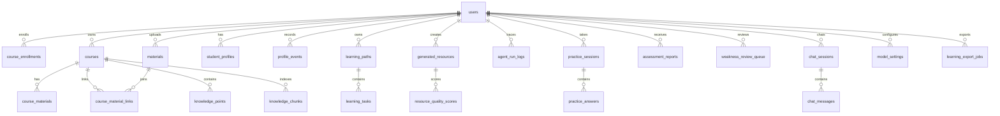

# EduNova 数据库设计

日期：2026-07-01

## 1. 设计目标

EduNova 数据库设计服务于学生个性化学习闭环。第一版需要同时支持内置课程、用户上传建课、RAG 检索、多智能体轨迹、学习画像、学习路径、练习评估和 演示模式。

设计原则：

1. 所有用户私有数据绑定 `user_id`。
2. 所有课程内学习数据绑定 `course_id`，但用户资料库资料可以先只绑定 `user_id`，再通过关联表加入课程。
3. 所有 AI 任务绑定 `trace_id`。
4. 生成内容必须可追溯引用来源。
5. JSON 字段用于保存灵活 AI 结构，但核心查询字段保持结构化。
6. 第一版结构为后续教师端、班级和课程包扩展预留空间。

## 2. 数据库技术

| 能力 | 技术 |
| --- | --- |
| 关系数据 | PostgreSQL |
| 向量检索 | pgvector |
| ORM | SQLAlchemy |
| 迁移 | Alembic |
| 长任务进度 | Redis |
| 文件内容 | 本地文件存储，数据库保存路径和元数据 |

当前 Phase 2A/2B/2C 已落地：

- `backend/app/core/config.py`：读取数据库和 Redis 配置。
- `backend/app/db/base.py`：SQLAlchemy metadata 入口。
- `backend/app/db/session.py`：engine 与 Session 工厂。
- `backend/app/models`：核心业务模型和学习闭环基础模型。
- `backend/app/data/builtin_courses/ai_intro.py`：人工智能导论内置课程包。
- `backend/app/services/course_seed.py`：内置课程导入服务。
- `backend/migrations`：Alembic 迁移目录。
- `backend/migrations/versions/20260701_0001_enable_pgvector.py`：启用 pgvector 扩展。
- `backend/migrations/versions/20260701_0002_create_core_learning_tables.py`：创建用户、课程、选课、资料、知识点和知识切片表。
- `backend/migrations/versions/20260701_0003_create_learning_closure_tables.py`：创建画像、学习路径、生成资源、Agent 轨迹、练习、报告、对话和模型设置基础表。
- `backend/migrations/versions/20260701_0004_add_user_starter_mode.py`：创建注册初始化方式字段。
- `backend/migrations/versions/20260703_0005_create_material_library.py`：创建独立个人资料库 `materials` 和课程资料关联表 `course_material_links`，并从旧 `course_materials` 兼容回填。

Phase 4.2 的 `/dashboard/summary` 不新增表和字段，只读取当前已有数据并整理为首页总览响应。Phase 4.4 后，资料库摘要和最近资料列表改为读取独立 `materials`，未归属数量通过 `course_material_links` 计算。

## 3. 核心关系图



## 4. 表设计

### 4.1 `users`

用途：保存用户账号。

核心字段：

| 字段 | 类型 | 说明 |
| --- | --- | --- |
| `id` | bigint | 主键 |
| `email` | varchar | 邮箱，唯一 |
| `hashed_password` | varchar | 加密密码 |
| `display_name` | varchar | 显示名称 |
| `role` | varchar | `student` 或 `admin` |
| `starter_mode` | varchar | 注册初始化方式，`blank` 或 `ai_intro` |
| `created_at` | timestamptz | 创建时间 |
| `updated_at` | timestamptz | 更新时间 |

约束：

- `email` 唯一。
- 第一版默认 `role=student`。
- 旧用户迁移默认 `starter_mode=blank`；新注册未传时由服务层按 `ai_intro` 处理。

### 4.2 `courses`

用途：保存内置课程和用户上传生成的课程。

核心字段：

| 字段 | 类型 | 说明 |
| --- | --- | --- |
| `id` | bigint | 主键 |
| `owner_id` | bigint | 创建者，内置课程可为空或指向系统用户 |
| `title` | varchar | 课程名称 |
| `description` | text | 课程说明 |
| `subject` | varchar | 学科 |
| `source_type` | varchar | `builtin`、`uploaded`、`demo` |
| `visibility` | varchar | `private`、`public` |
| `status` | varchar | `draft`、`ready`、`failed` |
| `agent_trace_id` | varchar | 建课 Graph 轨迹，可为空 |
| `created_at` | timestamptz | 创建时间 |

### 4.3 `course_enrollments`

用途：记录用户和课程关系。

字段：

| 字段 | 类型 | 说明 |
| --- | --- | --- |
| `id` | bigint | 主键 |
| `user_id` | bigint | 用户 |
| `course_id` | bigint | 课程 |
| `role` | varchar | 第一版为 `learner` |
| `progress_percent` | numeric | 进度 |
| `created_at` | timestamptz | 创建时间 |

唯一约束：

- `user_id + course_id` 唯一。

### 4.4 `course_materials`

用途：保存早期课程资料和内置课程知识切片来源。

当前已落地的 Phase 2 表结构把资料直接绑定到课程，`course_id` 为必填。Phase 3 重定向后，产品规则调整为“资料库独立于课程，资料可以加入一个或多个课程”。Phase 4.4 已完成兼容迁移：

```text
materials              独立资料库，绑定 user_id，不强制绑定 course_id
course_material_links  课程与资料的关联表，支持同一资料加入多个课程
knowledge_chunks       仍绑定 course_id，同时引用 material_id
```

迁移后，`course_materials` 暂时保留，用于兼容内置课程和已有 `knowledge_chunks.material_id` 关系；新上传资料写入 `materials`，加入课程时写入 `course_material_links`。Phase 5.1 从 TXT/Markdown 资料生成课程时，会为新课程创建兼容旧链路的 `course_materials` 副本，同时用 `course_material_links.usage_type=course_source` 关联原个人资料库资料，保证后续 RAG 可以沿 `knowledge_chunks -> course_materials` 接入。

Phase 11.2 的资料对比第一刀不新增表和迁移，也不持久化对比结果。`POST /materials/compare` 复用 `materials` 做当前用户资料所有权校验，复用 `course_material_links` 校验资料已绑定当前课程，优先读取 `knowledge_chunks.metadata_json.source_material_id` 与 `course_materials.metadata_json.source_material_id` 做课程切片对比；缺少切片时，仅对已解析 TXT/Markdown 的 `materials.extracted_text` 做短摘录 fallback。服务层只返回重复重点、疑似考点、独有点、遗漏点、优先顺序和安全引用摘要，不保存完整资料原文、系统提示词、模型输入或 API Key。

字段：

| 字段 | 类型 | 说明 |
| --- | --- | --- |
| `id` | bigint | 主键 |
| `user_id` | bigint | 上传者 |
| `course_id` | bigint | 所属课程 |
| `filename` | varchar | 原文件名 |
| `content_type` | varchar | 文件类型 |
| `storage_path` | text | 文件存储路径 |
| `parse_status` | varchar | 解析状态 |
| `extracted_text` | text | 提取文本 |
| `metadata_json` | jsonb | 页码、标题、字数等元数据 |
| `agent_trace_id` | varchar | 建课或资料处理 Graph 轨迹，可为空 |
| `created_at` | timestamptz | 创建时间 |

### 4.4.1 `materials`

用途：保存用户上传到个人资料库的原始资料和解析结果。Phase 4.4 已落地；`.txt`、`.md` 会轻解析为 `completed`，PDF/DOCX/PPTX/图片先保存为 `uploaded`，图片不做 OCR。

字段：

| 字段 | 类型 | 说明 |
| --- | --- | --- |
| `id` | bigint | 主键 |
| `user_id` | bigint | 上传者 |
| `filename` | varchar | 原文件名 |
| `content_type` | varchar | 文件类型 |
| `storage_path` | text | 文件存储路径 |
| `parse_status` | varchar | 解析状态 |
| `extracted_text` | text | 提取文本 |
| `metadata_json` | jsonb | 页码、标题、字数等元数据 |
| `agent_trace_id` | varchar | 上传解析或资料 Graph 轨迹，可为空 |
| `created_at` | timestamptz | 创建时间 |
| `updated_at` | timestamptz | 更新时间 |

约束与索引：

- `user_id` 外键指向 `users.id`。
- `ix_materials_user_status_created(user_id, parse_status, created_at)` 支持用户资料库列表和状态筛选。

### 4.4.2 `course_material_links`

用途：记录资料与课程的关联，支持同一资料进入多个课程。

字段：

| 字段 | 类型 | 说明 |
| --- | --- | --- |
| `id` | bigint | 主键 |
| `course_id` | bigint | 课程 |
| `material_id` | bigint | 资料 |
| `added_by_user_id` | bigint | 添加者 |
| `usage_type` | varchar | `reference`、`course_source`、`exam_review` 等 |
| `created_at` | timestamptz | 创建时间 |

唯一约束：

- `course_id + material_id` 唯一。

约束与索引：

- `course_id` 外键指向 `courses.id`。
- `material_id` 外键指向 `materials.id`。
- `added_by_user_id` 外键指向 `users.id`。
- `ix_course_material_links_course(course_id)`。
- `ix_course_material_links_material(material_id)`。

### 4.5 `knowledge_points`

用途：课程知识点。Phase 5.1 规则建课会根据 Markdown 标题或 TXT 段落为当前用户课程生成知识点。

字段：

| 字段 | 类型 | 说明 |
| --- | --- | --- |
| `id` | bigint | 主键 |
| `course_id` | bigint | 课程 |
| `title` | varchar | 知识点名称 |
| `summary` | text | 摘要 |
| `chapter` | varchar | 所属章节 |
| `order_index` | integer | 排序 |
| `difficulty` | varchar | 难度 |
| `prerequisites_json` | jsonb | 前置知识点 |

### 4.6 `knowledge_chunks`

用途：RAG 检索切片。Phase 5.1 会把 TXT/Markdown 资料按知识点切成文本片段写入本表，Phase 6.4 会复用既有 `Vector(1536)` 字段保存 OpenAI-compatible embedding 或显式本地 fallback 向量。

字段：

| 字段 | 类型 | 说明 |
| --- | --- | --- |
| `id` | bigint | 主键 |
| `course_id` | bigint | 课程 |
| `material_id` | bigint | 来源资料 |
| `knowledge_point_id` | bigint | 对应知识点 |
| `content` | text | 切片内容 |
| `page_number` | integer | 页码 |
| `section_title` | varchar | 小节标题 |
| `embedding` | vector | 1536 维向量，可为空 |
| `metadata_json` | jsonb | 来源元数据；Phase 6.4 后记录 `embedding_source`、`embedding_model`、`embedding_dimension`、`embedded_at` |

索引：

- `course_id`。
- `knowledge_point_id`。
- `embedding` 向量索引。

### 4.7 `student_profiles`

用途：保存学生当前画像。

字段：

| 字段 | 类型 | 说明 |
| --- | --- | --- |
| `id` | bigint | 主键 |
| `user_id` | bigint | 用户 |
| `profile_json` | jsonb | 8 维画像 |
| `confidence_score` | numeric | 当前画像可信度 |
| `updated_reason` | text | 最近一次更新原因摘要 |
| `created_at` | timestamptz | 创建时间 |
| `updated_at` | timestamptz | 更新时间 |

Phase 7.1 复用本表保存当前用户真实 8 维画像，不新增 `version` 字段；接口返回的 `version` 由当前画像关联的 `profile_events` 数量派生。

Phase 7.2 明确本表保存用户级长期画像，只保留一份，不为每门课程复制完整画像。专业背景、认知风格、学习偏好、学习节奏和长期目标优先放在这里；课程级目标、薄弱点、掌握度、复习队列和路径依据通过课程相关表或后续聚合接口表达。

### 4.8 `profile_events`

用途：记录画像变化证据链。

字段：

| 字段 | 类型 | 说明 |
| --- | --- | --- |
| `id` | bigint | 主键 |
| `user_id` | bigint | 用户 |
| `profile_id` | bigint | 对应画像，可为空 |
| `dimension` | varchar | 画像维度 |
| `change_summary` | text | 变化摘要 |
| `evidence_json` | jsonb | 证据引用和触发来源 |
| `created_at` | timestamptz | 创建时间 |

Phase 7.1 中课程问答只会在 `scope=course` 且用户问题出现明确困惑或薄弱信号时写入 `dimension="weak_points"` 的画像候选事件。`evidence_json` 只保存来源类型、课程 ID、会话 ID、消息 ID、trace ID 和安全引用摘要，不保存完整用户问题、系统提示词、模型输入或资料原文。

Phase 7.2 明确 `profile_events` 是证据流，不等同于正式弱点或学习事件总线。带课程来源的事件可作为课程学习状态候选证据，后续是否进入 `weakness_review_queue` 需要去重、合并或用户/练习结果确认。本阶段不新增通用 `learning_events` 表。

Phase 7.3 中 `GET /courses/{course_id}/learning-state` 会读取当前用户当前课程下的弱点候选事件，并按知识点或安全标题同步到 `weakness_review_queue` 的 `pending` 项。该同步不读取完整用户问题、系统提示词、模型输入或资料原文。

### 4.9 `learning_paths`

用途：保存学习路径。

Phase 7.2 明确学习路径是课程级能力，后续应基于课程学习状态、弱点复习队列、课程知识点和用户级画像生成；不只根据全局画像生成。

Phase 9 开始实际复用本表保存课程级学习路径，不新增迁移。生成新路径时，服务层会把同一用户同一课程旧 `active` 路径归档为 `archived`，再写入新的 `active` 路径。`plan_json` 只保存安全摘要、生成规则、计数、依据说明和可展示 metadata，不保存系统提示词、模型输入、API Key、完整课程资料原文或完整用户画像原文。

Phase 11.1 继续复用本表保存课程级期末冲刺计划，不新增迁移。冲刺计划使用 `status="sprint_active"` 和 `status="sprint_archived"`，`plan_json.kind="exam_sprint"`；生成新冲刺计划时只归档同一用户同一课程旧 `sprint_active`，不归档 Phase 9 普通 `active` 学习路径。`plan_json` 保存高频点、薄弱点、必刷题、易错提醒、推荐资源 ID、证据计数和任务天数映射等安全摘要，不保存系统提示词、模型输入、API Key、完整资料原文、完整用户画像原文或完整练习原始答案。

字段：

| 字段 | 类型 | 说明 |
| --- | --- | --- |
| `id` | bigint | 主键 |
| `user_id` | bigint | 用户 |
| `course_id` | bigint | 课程 |
| `title` | varchar | 路径标题 |
| `goal` | text | 学习目标 |
| `status` | varchar | 状态 |
| `plan_json` | jsonb | 路径结构 |
| `agent_trace_id` | varchar | 路径或冲刺 Graph 轨迹，可为空 |
| `created_at` | timestamptz | 创建时间 |
| `updated_at` | timestamptz | 更新时间 |

### 4.10 `learning_tasks`

用途：路径中的学习任务。

Phase 9 开始实际复用本表保存课程级路径任务。任务来源按 `reviewing` 弱点、`confirmed` 弱点、未覆盖知识点排序；`pending` 和 `dismissed` 弱点不进入路径任务。普通路径任务类型固定为 `review`、`learn`、`resource`，任务状态固定为 `todo`、`doing`、`completed`；第一条任务为 `doing`，其余为 `todo`。`recommended_resource_ids` 最多保存 3 个同课程资源 ID，优先匹配同知识点资源，没有知识点时按安全标题匹配。

Phase 11.1 期末冲刺计划也复用本表保存每日任务，`task_type` 使用 `sprint_review`、`sprint_practice`、`sprint_resource`，状态仍使用 `doing` / `todo`；第一条冲刺任务为 `doing`，其余为 `todo`。任务的天数分组保存在所属 `learning_paths.plan_json.task_days` 中。

字段：

| 字段 | 类型 | 说明 |
| --- | --- | --- |
| `id` | bigint | 主键 |
| `path_id` | bigint | 学习路径 |
| `user_id` | bigint | 用户 |
| `course_id` | bigint | 课程 |
| `knowledge_point_id` | bigint | 知识点 |
| `title` | varchar | 任务标题 |
| `task_type` | varchar | 普通路径为 `review`、`learn`、`resource`；期末冲刺为 `sprint_review`、`sprint_practice`、`sprint_resource` |
| `reason` | text | 推荐理由 |
| `recommended_resource_ids` | jsonb | 推荐资源 ID 列表 |
| `status` | varchar | `todo`、`doing`、`completed` |
| `due_at` | timestamptz | 建议完成时间 |
| `next_review_at` | timestamptz | 下次复习时间 |

### 4.11 `generated_resources`

用途：保存 AI 生成学习资源。

Phase 8.2 开始实际复用该表保存 5 类课程资源。Phase 8.2.1 不新增迁移，改为课程引用驱动的确定性可用稿优先，模型只做增强。资源分层规则固定为：`course_id != null` 是课程资源，本阶段只生成这一类；`course_id == null` 预留为后续个人全局资源，不在本阶段生成。Phase 13.1 新增 nullable `agent_trace_id`，资源生成 trace 同时写入独立字段和 `content_json.metadata.agent_trace_id`，接口响应继续显式返回 `agent_trace_id` 以兼容旧前端。

服务层必须保证：

- 新建课程资源时强制写入当前用户自己的 `user_id` 和非空 `course_id`。
- `knowledge_point_id` 若存在，必须属于同一课程。
- `citation_json` 只保存安全引用摘要，不保存完整课程资料原文。
- `content_json` 不保存系统提示词、完整模型输入、API Key 或完整用户画像原文。
- `content_json.metadata.generation_mode` 保存 `model_enhanced`、`deterministic_source` 或 `low_evidence_fallback`，用于区分模型增强、本地可用稿和低依据稿。
- 模型未配置或调用失败时可以写入确定性可用稿；只要课程依据和资源必备结构足够，`review_status` 仍可为 `passed`。
- `review_status="low_evidence"` 只表示课程依据不足或只能生成低依据稿，不等同于模型未调用或模型失败。

字段：

| 字段 | 类型 | 说明 |
| --- | --- | --- |
| `id` | bigint | 主键 |
| `user_id` | bigint | 用户 |
| `course_id` | bigint | 课程 |
| `knowledge_point_id` | bigint | 知识点 |
| `resource_type` | varchar | 资源类型 |
| `title` | varchar | 标题 |
| `content_json` | jsonb | 结构化内容 |
| `citation_json` | jsonb | 引用来源 |
| `status` | varchar | 生成状态 |
| `review_status` | varchar | 审核状态 |
| `confidence_score` | numeric | 可信度 |
| `agent_trace_id` | varchar | ResourceGenerationGraph 轨迹，可为空 |
| `created_at` | timestamptz | 创建时间 |
| `updated_at` | timestamptz | 更新时间 |

### 4.12 `resource_quality_scores`

用途：保存资源质量评分。

Phase 8.2 生成资源时同步写入质量分。Phase 8.2.1 后，质量分由规则评分生成：`source_match` 看引用数量和章节覆盖，`profile_fit` 看画像目标、基础和薄弱点是否被使用，`fact_confidence` 看课程依据和模型增强状态，`difficulty_fit` 看请求难度是否进入资源内容，`completeness` 看各资源类型必备结构是否齐全。评分说明只保存可展示的安全摘要，不保存模型提示词、完整资料原文或用户隐私原文。

字段：

| 字段 | 类型 | 说明 |
| --- | --- | --- |
| `id` | bigint | 主键 |
| `resource_id` | bigint | 资源 |
| `score_name` | varchar | 评分项名称 |
| `score_value` | numeric | 评分值 |
| `rationale` | text | 评分说明 |
| `created_at` | timestamptz | 创建时间 |

### 4.13 `agent_run_logs`

用途：保存多智能体轨迹。

Phase 8.1 开始实际复用该表提供 `/agents/traces/{trace_id}` 查询。Phase 13.1 后学习闭环生产 Graph 均使用同一张表记录节点轨迹，资源生成步骤固定为 `profile`、`retrieve`、`diagnosis`、`resource`、`review`、`persist`，课程问答步骤固定为 `profile`、`retriever`、`tutor`、`weakness`、`review`、`next_action`。服务层必须按当前用户隔离 trace，响应只返回安全摘要和白名单元数据，不返回系统提示词、模型输入、API Key、完整资料原文或用户隐私原文。

字段：

| 字段 | 类型 | 说明 |
| --- | --- | --- |
| `id` | bigint | 主键 |
| `trace_id` | varchar | 任务编号 |
| `user_id` | bigint | 用户 |
| `course_id` | bigint | 课程 |
| `agent_name` | varchar | Agent 名称 |
| `step_index` | integer | 步骤 |
| `status` | varchar | 状态 |
| `input_summary` | text | 输入摘要 |
| `output_summary` | text | 输出摘要 |
| `duration_ms` | integer | 耗时 |
| `metadata_json` | jsonb | 安全摘要、引用摘要和补充元数据 |
| `created_at` | timestamptz | 创建时间 |

索引：

- `trace_id`。
- `user_id`。
- `course_id`。

### 4.14 `practice_sessions`

用途：保存一次练习。

Phase 10 开始实际复用本表保存课程级练习会话，不新增迁移。练习必须绑定 `user_id` 和 `course_id`，只能由当前用户访问。题目第一刀不新增单独题目表，而是在创建练习时用 `practice_answers.question_json` 保存安全题目结构，提交后再用同表保存作答和反馈。

字段：

| 字段 | 类型 | 说明 |
| --- | --- | --- |
| `id` | bigint | 主键 |
| `user_id` | bigint | 用户 |
| `course_id` | bigint | 课程 |
| `title` | varchar | 练习标题 |
| `status` | varchar | 进行中、已完成 |
| `score` | numeric | 得分 |
| `agent_trace_id` | varchar | AssessmentGraph 轨迹，可为空 |
| `created_at` | timestamptz | 创建时间 |
| `updated_at` | timestamptz | 更新时间 |

### 4.15 `practice_answers`

用途：保存每道题作答和批改。

Phase 10 中，创建练习时先写入 `answer_text=null`、`is_correct=null` 的占位行，用 `question_json` 保存 `single_choice`、`multiple_choice` 和 `short_answer` 题目；提交答案时替换为真实作答记录并写入确定性批改反馈。`question_json` 只保存题目、选项、知识点、关键词和安全解释，不保存系统提示词、模型输入、API Key 或完整课程资料原文。

字段：

| 字段 | 类型 | 说明 |
| --- | --- | --- |
| `id` | bigint | 主键 |
| `session_id` | bigint | 练习 |
| `user_id` | bigint | 用户 |
| `question_json` | jsonb | 题目 |
| `answer_text` | text | 学生答案 |
| `is_correct` | boolean | 是否正确 |
| `feedback_json` | jsonb | 批改反馈 |
| `created_at` | timestamptz | 创建时间 |

### 4.16 `assessment_reports`

用途：保存学习评估报告。

Phase 10 开始实际复用本表保存课程学习报告，不新增迁移。报告基于课程、可选练习、弱点队列和掌握度摘要生成，`report_json` 只保存可展示摘要、证据引用、下一步建议和复习队列更新摘要，不保存完整用户画像原文、完整课程资料原文、系统提示词、模型输入或 API Key。

字段：

| 字段 | 类型 | 说明 |
| --- | --- | --- |
| `id` | bigint | 主键 |
| `user_id` | bigint | 用户 |
| `course_id` | bigint | 课程 |
| `practice_session_id` | bigint | 来源练习，可为空 |
| `report_json` | jsonb | 报告内容 |
| `score` | numeric | 综合得分 |
| `agent_trace_id` | varchar | ReportGraph 轨迹，可为空 |
| `created_at` | timestamptz | 创建时间 |

### 4.17 `weakness_review_queue`

用途：保存薄弱点复习队列。

Phase 7.2 明确本表承载课程级可执行复习任务。每个复习项必须绑定 `course_id`，候选来源可以来自画像事件、课程问答或练习评估，但进入队列前必须去重或合并，避免同一知识点反复生成多条任务。

Phase 7.3 复用本表，不新增迁移。虽然历史模型允许 `course_id` 为空，本阶段服务层强制课程问答候选事件入队时写入非空 `course_id`；`source_type="course_question"`，`status="pending"` 表示待确认/待复习，不表示系统已经完成正式诊断。

Phase 7.4 继续不新增迁移，复用 `status` 字段承载队列状态流转：`pending` 表示待确认，`confirmed` 表示学生已确认待复习，`reviewing` 表示复习中，`completed` 表示已完成本轮复习，`dismissed` 表示软忽略/移出主列表。`dismissed` 不物理删除，仍参与课程内去重，避免同一课程问答候选事件在下次 `learning-state` 同步时重新入队。

Phase 9 继续复用本表，不新增字段。`GET /courses/{course_id}/learning-state` 会为 `confirmed/reviewing/completed` 项确定性补充同课程推荐资源：优先同知识点资源，没有知识点时按安全标题匹配，每项最多 3 个资源 ID。`pending` 项仍只表达待确认语义，不直接进入学习路径。`complete` 操作后会设置下一次复习时间；`confirmed/reviewing` 项缺少 `next_review_at` 时，学习状态读取可补齐确定性复习时间。推荐资源和复习时间只写已有 `recommended_resource_ids` 与 `next_review_at` 字段。

Phase 10 继续复用本表，不新增字段。练习评估中的错题或低分题会以 `source_type="practice_assessment"` 写入课程级 `confirmed` 复习项，因为它来自学生真实作答证据；课程问答候选事件仍保持 `pending` 待确认语义。练习来源入队按同课程同知识点或安全标题去重，不保存完整答案之外的隐私资料原文、系统提示词或模型输入。

字段：

| 字段 | 类型 | 说明 |
| --- | --- | --- |
| `id` | bigint | 主键 |
| `user_id` | bigint | 用户 |
| `course_id` | bigint | 课程 |
| `knowledge_point_id` | bigint | 薄弱知识点 |
| `title` | varchar | 复习项标题 |
| `source_type` | varchar | 来源类型 |
| `status` | varchar | `pending`、`confirmed`、`reviewing`、`completed`、`dismissed` |
| `recommended_resource_ids` | jsonb | 推荐资源 |
| `next_review_at` | timestamptz | 下次复习时间 |
| `created_at` | timestamptz | 创建时间 |
| `updated_at` | timestamptz | 更新时间 |

### 4.18 `chat_sessions` 与 `chat_messages`

用途：保存 AI 辅导会话。

Phase 3 重定向后，会话需要区分主页会话和课程会话：

- 主页会话：`scope=home`，`course_id` 可以为空。
- 课程会话：`scope=course`，`course_id` 必填。
- 主页会话可以移入课程，移入后可设置 `archived_from_home=true` 或记录迁移事件。

`chat_sessions`：

- `id`。
- `user_id`。
- `scope`。
- `course_id`，主页会话可为空。
- `title`。
- `mode`。
- `archived_from_home`。
- `created_at`。

`chat_messages`：

- `id`。
- `session_id`。
- `user_id`。
- `role`。
- `content`。
- `citation_json`。
- `trace_id`。
- `created_at`。

### 4.19 `model_settings`

用途：保存用户模型设置。Phase 6.1 复用本表完成一人一套配置；Phase 6.2 通过 Alembic `20260704_0006` 扩展为同一用户多套配置，去掉 `user_id` 唯一限制，用户 API Key 使用 Fernet 加密后写入 `api_key_ciphertext`，系统 `.env` 模型配置不写入本表。

字段：

| 字段 | 类型 | 说明 |
| --- | --- | --- |
| `id` | bigint | 主键 |
| `user_id` | bigint | 用户 |
| `display_name` | varchar | 当前用户内的配置名称 |
| `preset_id` | varchar | 前端 Provider 预设标识，如 `spark`、`deepseek`、`ollama` |
| `provider` | varchar | 模型协议供应商，当前统一为 `openai_compatible` |
| `base_url` | text | OpenAI-compatible 接口地址，讯飞星火 Spark 推荐 `https://spark-api-open.xf-yun.com/v1` |
| `api_key_ciphertext` | text | 加密后的 API Key |
| `chat_model` | varchar | 聊天模型 |
| `embedding_model` | varchar | 可空向量模型，Phase 6.4 后用于 OpenAI-compatible `/embeddings`；缺省时使用显式本地 fallback |
| `tool_flags_json` | jsonb | 预留工具标记，当前设置页不管理联网搜索或深度思考 |
| `is_default` | boolean | 是否为当前用户默认配置 |
| `last_test_ok` | boolean | 最近一次连接测试是否成功 |
| `last_test_message` | text | 最近一次连接测试的脱敏结果摘要 |
| `last_tested_at` | timestamptz | 最近一次连接测试时间 |
| `created_at` | timestamptz | 创建时间 |
| `updated_at` | timestamptz | 更新时间 |

要求：

- 不保存明文 Key。
- 日志不记录 Key。
- 前端只显示脱敏 Key。
- `api_key` 为空字符串或请求缺省时，保存接口保留原密钥。
- 缺少 `MODEL_SETTINGS_ENCRYPTION_KEY` 时，不允许保存新的用户 Key。
- 同一用户可保存多套配置；运行时只使用当前用户 `is_default=true` 的配置，默认不存在时回退服务器 `.env`。
- 删除默认配置后，后端会把剩余配置中最近更新的一条设为默认。
- 设置页 Provider 预设首位为讯飞星火 Spark；预设只负责填充 OpenAI-compatible 连接参数，不改变后端协议。
- `20260704_0006` 迁移为旧数据补 `display_name` 和 `is_default=true`，保证 Phase 6.1 的旧单配置继续可用。

### 4.20 `learning_export_jobs`

用途：预留给后续异步学习档案导出任务。

Phase 12.1 的 Markdown 学习档案导出不使用本表、不新增迁移，也不在服务器端持久化导出文件。`POST /exports/learning-dossier` 同步读取当前用户课程、最新报告、弱点队列、学习路径、资源和练习证据摘要，直接返回 Markdown 字符串与安全文件名，由前端创建浏览器下载。当前导出只保存可展示摘要，不保存完整资料原文、完整作答原文、内部指令、模型请求内容、密钥、登录令牌或完整用户画像。

字段：

| 字段 | 类型 | 说明 |
| --- | --- | --- |
| `id` | bigint | 主键 |
| `user_id` | bigint | 用户 |
| `course_id` | bigint | 课程 |
| `status` | varchar | 导出状态 |
| `export_type` | varchar | `markdown` |
| `output_path` | text | 输出路径 |
| `created_at` | timestamptz | 创建时间 |
| `finished_at` | timestamptz | 完成时间 |

## 5. JSON 字段约定

### 5.1 `profile_json`

```json
{
  "major_background": "",
  "knowledge_foundation": "",
  "learning_goal": "",
  "cognitive_style": "",
  "learning_preference": "",
  "weak_points": [],
  "learning_pace": "",
  "motivation_interest": ""
}
```

### 5.2 `citation_refs`

```json
[
  {
    "chunk_id": 1,
    "material_id": 1,
    "source_title": "人工智能导论讲义",
    "page_number": 12,
    "section_title": "启发式搜索",
    "content_preview": "启发式搜索利用启发函数..."
  }
]
```

### 5.3 `mastery_json`

```json
{
  "knowledge_point_id": 8,
  "status": "weak",
  "score": 0.42,
  "evidence_refs": []
}
```

## 6. 索引策略

第一版必须创建的索引：

- `users.email` 唯一索引。
- `course_enrollments(user_id, course_id)` 唯一索引。
- `courses.owner_id`。
- `courses.agent_trace_id`。
- `course_materials(user_id, course_id)`，用于当前 Phase 2 已落地的课程资料表。
- `course_materials.agent_trace_id`。
- `materials(user_id, parse_status, created_at)`，用于当前用户资料库列表和状态筛选。
- `materials.agent_trace_id`。
- `course_material_links(course_id, material_id)` 唯一索引，用于避免同一资料重复加入同一课程。
- `knowledge_points(course_id)`。
- `knowledge_chunks(course_id)`。
- `knowledge_chunks(knowledge_point_id)`。
- `knowledge_chunks.embedding` 向量索引。
- `student_profiles.user_id`。
- `learning_paths.agent_trace_id`。
- `learning_tasks(user_id, course_id, status)`。
- `generated_resources(user_id, course_id)`。
- `generated_resources.agent_trace_id`。
- `agent_run_logs.trace_id`。
- `practice_sessions(user_id, course_id)`。
- `practice_sessions.agent_trace_id`。
- `assessment_reports(user_id, course_id)`。
- `assessment_reports.agent_trace_id`。
- `weakness_review_queue(user_id, course_id, status)`。
- `chat_sessions(user_id, scope, course_id)`，支持主页会话和课程会话分开查询。

## 7. 数据隔离规则

所有查询必须遵守：

```text
当前用户只能访问自己拥有或已加入的课程数据。
当前用户只能访问自己的画像、路径、资源、报告、对话和导出任务。
系统内置课程可被所有用户读取，但用户学习记录仍然私有。
```

接口层和服务层都应校验访问权限。不能只依赖前端隐藏入口。

## 8. Starter 与 Demo 数据规则

注册新账号时，系统通过 `starter_mode` 决定是否初始化示例内容：

- `blank`：不创建内置课程副本、示例资料和示例历史。
- `ai_intro`：把系统内置“人工智能导论”课程、示例资料、知识点和知识切片复制到当前用户空间。

`starter_mode` 只影响当前用户初始化，不等同于共享演示账号，也不能让多个真实用户共用同一份可写学习记录。当前实现中，`ai_intro` 不创建主页历史、画像、练习或最近学习记录；这些数据后续由真实使用行为生成。

演示模式后续如启用，可使用固定演示账号：

```text
demo@edunova.local
```

Demo 数据要求：

- 可重置。
- 与真实用户数据隔离。
- fallback 资源明确标记。
- 不使用真实个人隐私数据。
- 不通过登录页共享演示学生按钮进入主注册登录流程。

## 9. 迁移策略

使用 Alembic 管理数据库变更。

规则：

1. 所有数据库变更必须进入 Alembic 迁移。
2. 每次修改模型后生成或手写对应迁移脚本。
3. 迁移脚本进入 Git。
4. 不能手动要求用户在数据库执行未记录 SQL。
5. 表和字段命名保持小写下划线。
6. 删除字段前先确认没有业务依赖。
7. pgvector 扩展由首条迁移 `20260701_0001_enable_pgvector.py` 启用。
8. 第一批核心业务表由迁移 `20260701_0002_create_core_learning_tables.py` 创建。
9. 学习闭环基础表由迁移 `20260701_0003_create_learning_closure_tables.py` 创建。
10. 用户注册初始化方式由迁移 `20260701_0004_add_user_starter_mode.py` 创建。
11. 独立资料库和课程资料关联由迁移 `20260703_0005_create_material_library.py` 创建。
12. 学习产物 Graph trace 字段由迁移 `20260707_0007_add_learning_artifact_agent_trace_ids.py` 创建。

当前迁移命令：

```powershell
.\.venv\Scripts\python -m alembic upgrade head
```

## 10. 数据库验收标准

第一版数据库达到以下标准才算可用：

1. 数据库配置可从环境变量读取。
2. Alembic 能连接 PostgreSQL 并执行迁移。
3. pgvector 扩展可通过迁移启用。
4. 所有核心表可通过迁移创建。
5. 内置人工智能导论课程可导入。
6. 当前内置课程资料能写入课程、材料、知识点和知识切片。
7. Phase 4.4 后，上传资料能先进入用户资料库，再选择加入课程。
8. Phase 5.1 后，已解析 TXT/Markdown 资料能生成用户自己的课程、课程资料副本、资料关联、知识点和知识切片；非文本和未解析资料不得生成课程。
9. RAG 检索能读取向量数据。
10. 资源、报告、课程内对话都能追溯用户、课程和 trace；主页对话能追溯用户和 trace。
11. 两个不同用户的数据互不可见。
12. Demo 数据可重置且不污染普通用户数据。
13. Phase 6.2 后，用户模型 Key 必须按配置独立加密保存，读取设置只能返回来源、模型、默认配置、脱敏 Key 和可用性；课程 RAG 回答的 `trace_id` 和 `citation_json` 必须可追溯。
14. Phase 6.4 后，知识切片向量必须保持 1536 维合同，外部 embedding 失败不得阻断建课或问答，fallback 来源必须写入 metadata。
15. Phase 7.2 后，用户级画像只保留一份，课程级学习状态通过课程相关事件、弱点队列、路径和后续聚合接口表达，不新增通用 `learning_events` 表。
16. Phase 7.3 后，课程问答弱点候选事件可通过 `/courses/{course_id}/learning-state` 同步为当前课程 `weakness_review_queue` 的 `pending` 项，服务层强制绑定 `course_id`。
17. Phase 7.4 后，弱点复习项通过课程绑定接口进行确认、开始、完成和软忽略；`dismissed` 项不返回主列表，但必须继续参与去重。
18. Phase 10 后，练习会话、作答、报告和练习评估来源弱点都复用已有表；练习错题或低分题可生成 `practice_assessment` 来源的 `confirmed` 队列项，并影响 `/courses/{course_id}/mastery-map` 和 `/courses/{course_id}/learning-state`。
19. Phase 11.1 后，期末冲刺计划复用 `learning_paths` 和 `learning_tasks`，使用 `sprint_active` / `sprint_archived` 与 `plan_json.kind="exam_sprint"` 区分普通学习路径，不新增表或迁移。
20. Phase 11.2 后，资料对比复用 `materials`、`course_material_links`、`course_materials` 和 `knowledge_chunks`，不新增表、不持久化结果；`material_ids` 指资料库 `materials.id`，服务层强制校验当前用户所有权和课程绑定关系。
21. Phase 13.1 后，课程、资料、资源、路径、冲刺、练习和报告等学习产物可通过 nullable `agent_trace_id` 反查对应 Graph；字段为空时仍保持旧数据兼容。

当前已验证：

- Alembic 能创建 `users`、`courses`、`course_enrollments`、`course_materials`、`materials`、`course_material_links`、`knowledge_points`、`knowledge_chunks`。
- Alembic metadata 已注册并迁移创建 `student_profiles`、`profile_events`、`learning_paths`、`learning_tasks`、`generated_resources`、`resource_quality_scores`、`agent_run_logs`、`practice_sessions`、`practice_answers`、`assessment_reports`、`weakness_review_queue`、`chat_sessions`、`chat_messages` 和 `model_settings`。
- `knowledge_chunks.embedding` 使用 `vector(1536)`。
- `knowledge_chunks.embedding` 已建立 `ivfflat` 向量索引。
- 第二条迁移已完成 downgrade/upgrade 往返验证。
- `users.starter_mode` 已进入模型和迁移合同，旧用户默认 `blank`。
- 人工智能导论内置课程包可导入，包含 12 个知识点和 24 个基础资料切片。
- 内置课程导入具备幂等性，重复执行不会创建重复课程。
- Phase 4.2 首页总览服务已验证只请求当前用户数据：blank 用户返回空课程/空资料/空历史，ai_intro 用户返回自己空间中的人工智能导论课程和资料，已有进度时显示真实进度，没有进度时显示“未开始”。
- Phase 4.4 资料库服务已验证上传、列表、详情、进度和加入课程都只访问当前用户数据；迁移 `0005` 会把旧 `course_materials` 兼容复制为 `materials` 与 `course_material_links`。
- Phase 5.1 课程生成服务已验证 TXT/Markdown 资料能创建 `courses`、`course_enrollments`、`course_materials`、`course_material_links`、`knowledge_points` 和 `knowledge_chunks`；A 用户不能用 B 用户资料建课，也不能读取 B 用户课程。
- Phase 6.2 模型设置服务已验证用户 API Key 不以明文进入数据库，同一用户多套模型配置互相隔离，空 `api_key` 保存会保留原密钥，缺少加密 Key 时拒绝保存用户 Key；课程会话命中引用且默认模型配置可用时，assistant 内容来自模型回答，`citation_json` 保留真实引用，`trace_id` 非空。
- Phase 6.4 已验证 OpenAI-compatible embedding 请求、`dimensions` 重试、维度不匹配拒绝、本地 `local-hash-1536` fallback、课程生成 best-effort 写入向量和 RAG 混合排序字段。
- Phase 7.1 已验证 `student_profiles` 和 `profile_events` 支持当前用户画像读取、画像对话更新、事件倒序、多用户隔离，以及课程问答弱点候选事件的隐私安全证据写入。
- Phase 7.2 已完成用户级画像与课程级学习状态的数据库边界设计；本阶段不新增迁移，不新增 `learning_events`。
- Phase 7.3 已验证课程学习状态服务能读取当前课程弱点候选事件、按知识点或标题去重生成 `pending` 复习项，并保持多用户、跨课程和隐私隔离。
- Phase 7.4 已验证弱点复习项状态流转、多用户和跨课程隔离、非法流转拦截、`dismissed` 防重新入队以及主列表过滤。
- Phase 11.2 已验证资料对比服务只访问当前用户自己的课程和资料，未绑定当前课程资料返回 404，少于两份可比较资料返回 400；课程切片和 TXT/Markdown fallback 都只返回安全短摘录，不泄露完整资料原文、系统提示词、模型输入或 API Key。
